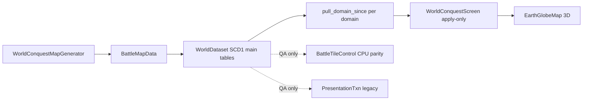

# Empires of Yesterday — Design & Dictionary

**Last updated:** August 1, 2026  
**The game:** World Conquest — a fluid territory-conquest sim (Creeper World style) on a 360×180 Earth globe, with multi-structure logistics and units. This is the only game mode; all legacy modes (galaxy campaign, tactical squads, planet runs, RTS World prototype) were removed.

---

## 1. Core Fantasy

Two empires fight for Earth. Each side's power is a **fluid**: blue (friendly) and red (hostile) pressure pumped from a home capital, spreading across a height-mapped tile grid, cancelling on contact. Territory is the primary army — but you also field **soldiers** and **bombers** from player-built **barracks** and **hangars**. You shape the war with **outposts** that pump pressure forward from owned land. Strategic minerals (**Aurelium**, **Verdantite**, **Emberstone**) fund unit spawn and soldier upkeep. Oceans are crossed by **soldier ferry** (beachhead claim), not land bridges.

The objective is **total conquest**: own every reachable claimable land tile, or grind the enemy's cumulative pressure to zero. Units and economy support the front; they do **not** change the win formula (see Design locks F5).

---

## 2. Run Loop

1. **Main Menu** → **Play** (random seed, or fixed seed via `RunState.run_seed`) or **Custom World…** (criteria + seed → Generate & Play). The seed controls **map terrain noise and resource scatter**; with Custom World, continents are **procedurally generated** from the seed (`procedural: true`), and `land_bias` / `mountain_bias` / `resource_density` reshape land fraction, mountains, and deposit count. Capital placement is chosen at deploy time (`start_region` biases auto-pick). Optional **AI vs AI** checkbox (`RunState.ai_vs_ai`, or env `EOY_AI_VS_AI=1`) skips deploy, mutes build input, and runs the multi-structure planner on both sides (outposts, barracks, hangars) for spectator / perf testing (orbit/zoom still work).
2. **Deploy pick** — after the globe loads (~2.5 s minimum), a ~5 s window opens: orbit/zoom the Earth, click land to **lock** your capital, then press **Deploy** (Deploy does nothing until locked). On timer expiry, hover land is used if valid, otherwise a random land cell is chosen (“Capital auto-deployed”). Enemy deploys to the furthest land from your capital. The sim does not tick until deploy resolves.
3. **World Conquest screen** — live sim on the 3D globe. Watch the fronts, manage Supply / minerals, place structures, field units. On a player's **first run** (`RunState.first_run_clarity`), contextual teach beats appear as **non-blocking top banners** (GameTheme panel, mouse-filter ignore) when relevant systems surface:
   - **Pressure** — match goes LIVE.
   - **Outpost** — Supply ≥ 400 after pressure beat.
   - **Minerals** — first outpost placed, or Supply ≥ 400 after outpost beat.
   - **Ferry** — player owns a coast tile, or 90 sim-seconds after minerals beat.
   - **Bombers** — barracks/hangar affordable, or 120 sim-seconds elapsed.
   Each beat auto-dismisses after 8 s (pressure also dismisses on click; outpost on arm/place). `first_run_clarity` clears after the last beat or when the battle ends. QA harness sets `first_run_clarity = false`.
4. Battle ends on conquest / zero enemy power / `MAX_SIM_TIME_SEC` (2h sim) → **Battle Over** BI match dashboard (KPIs, side-by-side comparison, forces/meta rows) → **Play Again** (new random seed; keeps Custom World criteria if set), **Same Map** (keep `RunState.run_seed`, new deploy pick on same terrain), or **Menu** (clears Custom World criteria).

### Custom World (Main Menu)

Secondary flow from **Custom World…**. Criteria are stored on `RunState` and passed into `WorldConquestMapGenerator.generate(..., criteria)`. Default **Play** resets criteria so the vanilla path is unchanged. Custom World sets `procedural: true` so land is **continental noise from seed**, not the Earth mask with coast grow/shrink.

| Criterion | RunState | Effect |
|-----------|----------|--------|
| Seed | `run_seed` | Drives procedural continents, elev noise, resource RNG |
| Procedural | `custom_world` → `criteria.procedural` | New land mask (no Earth `land.bin`); skips sphere pack cell cache; distinct albedo/height cache tag |
| Land / ocean | `land_bias` (−1…+1) | Shifts continental noise land threshold (more/less land) |
| Resource density | `resource_density` (0.25…2×) | Scales `RESOURCE_BLOBS_PER_TYPE` |
| Mountains | `mountain_bias` (−1…+1) | Elev shift + mountain threshold |
| Start region | `start_region` | Auto-deploy preference: any / west / east hemisphere |
| AI difficulty | `ai_difficulty` | Beginner / Medium / Expert (`EnemyStrategy`) |
| Map | `world_map_id` | Catalog id (Earth palette/resolution; land topology is procedural) |

### Controls

| Input | Action |
|-------|--------|
| Right-drag | Orbit globe (also during deploy pick) |
| Mouse wheel | Zoom (clamped 155–320 units) |
| Left-click (deploy) | Lock capital on **land** only; water rejected |
| **Deploy** | Confirm locked capital (disabled until lock) |
| Left-click | Place structure (when a build mode is armed) |
| **Outpost (400)** | Arm outpost (spawner) placement |
| **Barracks (400)** | Arm barracks placement — spawns soldiers |
| **Hangar (400)** | Arm hangar placement — spawns bombers |
| **Inspect** | Tile inspector mode |
| **Pause** / **▶ x1** | Pause / Resume (Space) / cycle sim speed |
| Esc | Cancel build mode; during deploy, clears capital lock |
| F3 | Toggle perf HUD (see PERFORMANCE.md) |
| **Same Map** (end screen) | Rematch on the current map seed — returns to deploy pick (new capital placement) |

---

## 3. Key Terms & Mechanics Dictionary

| Term | Definition | Code Reference |
|------|------------|----------------|
| **Claimable tile** | Land tile reachable (BFS over passable cells) from either side's spawn, or opened by a ferry **beachhead**. Only claimable tiles change ownership. | `BattleTileControl._is_claimable_index`, `extend_beachhead_from_landing` |
| **Pressure** | Continuous per-tile influence (sim truth), one float array per side. Not capped by terrain height. | `BattleTileControl.pressure_friendly / pressure_hostile` |
| **Owners** | Discrete per-tile ownership from **simple majority pressure**: `pf > ph` → friendly, `ph > pf` → hostile, equal (incl. 0/0) → neutral. Enum still reserves `3=contested` for legacy/UI. `4=unclaimable`. HQ homes force-owned. | `BattleTileControl.owners`, `sim::sync_ownership_tile` |
| **Effective height** | `H = pressure + terrain_elevation` (elevation 0–100, `HEIGHT_MAX`). Gradient flow equalizes `H` across neighbors — fluid pools in basins and only tops mountains when deep enough. | `BattleTileControl.effective_height` |
| **Gradient flow** | Per-round cardinal-neighbor flow: if `H_src − H_n > MIN_FLOW_DELTA`, move `∝ delta × FLOW_CONDUCTIVITY × edge_flow`, capped at `MAX_OUTFLOW_FRAC` of source per pass. | `BattleTileControl._gradient_flow_tile` |
| **Cancellation** | Overlapping friendly/hostile pressure subtract (`min` of both removed). | `_propagate_simple_water` |
| **Home pump** | Capital tile injects `HOME_START_POWER × (1 + force × 0.01)` × `PRESSURE_SOURCE_OUTPUT_MULT` (0.7) × `WORLD_CONQUEST_PRESSURE_SCALE` (1/2000) every `PRESSURE_INJECT_INTERVAL_ROUNDS` (7) sim rounds. | `BattleTileControl.home_spawn_rate_for_force`, `WorldConquestConfig` |
| **Territory overlay (live)** | Ownership overlay with **pressure depth tint** (hybrid): R8 owner/border paint plus interior shading from local pressure depth so fronts read as pooling fluid. **Sim truth unchanged** — gradient flow still uses H = P + E. | `ownership_display.gdshader`, `TerritoryKernel.display_byte_for`, `OVERLAY_OWNERS_ONLY` |
| **Inspect probe** | Hovered tile shows terrain **elevation** (0–100) and **effective height H** (= own-side pressure + elevation), plus pressures and claimability. | `WorldConquestScreen._update_tile_probe`, `query_tile` |
| **Supply** | Player wallet. Starts at `STARTING_SUPPLY` (1200); income `INCOME_PER_TILE_PER_SEC` (0.8) per owned tile. Spent on outposts (400), barracks (400), and hangars (400). | `WorldConquestScreen`, `WorldConquestConfig`, `EconomyCatalog` |
| **Outpost (spawner)** | Player-placed pressure pump. Lands on the exact clicked tile; placement is allowed on any land tile except enemy-held ones. **Builds instantly** on valid placement (R1). | `WorldConquestOutpostBuild.gd`, `WorldConquestScreen._resolve_placement` |
| **Barracks** | Supply cost 400; **instant** place. Spawns **soldiers** every `BARRACKS_SPAWN_INTERVAL_SEC` (10 s) for Aurelium + Verdantite. Cap **5** living per barracks; global soldier cap **100**. | `EconomyCatalog`, `world_session.rs`, `agents.rs` |
| **Hangar** | Supply cost 400; **instant** place. Spawns **bombers** every `HANGAR_SPAWN_INTERVAL_SEC` (10 s) for Aurelium + Emberstone. Cap **5** living per hangar; global bomber cap **100**. | `EconomyCatalog`, `world_session.rs`, `bombers.rs` |
| **Soldier** | Ground unit: aura pressure + erode enemy pressure; moves on land; can **ferry** open water. **Aurelium + Verdantite upkeep**; Au deficit applies `SOLDIER_UPKEEP_DEFICIT_DPS`. Orphan damage if barracks destroyed. | `WorldConquestConfig`, `agents.rs` |
| **Bomber** | Air unit: bombs any non-team land (incl. unreached islands — **not** ferry-gated). Bomb opens claimability on the struck cell, then majority pressure flips owner. **No continuous mineral upkeep** (spawn cost only) — intentional (Design lock A14). | `bombers.rs`, `battle_nav::is_air_strike_goal`, `world_edit::open_claimable_for_air_strike` |
| **Soldier ferry / beachhead** | When no land frontier remains on the current mass, water becomes allowed. Landing on unowned land runs `extend_beachhead_from_landing` so the new landmass becomes claimable. Open-water move rate is **0.25×** land (`SOLDIER_FERRY_MOVE_MULT`). | `agents.rs`, R2 |
| **Operational sources** | (Legacy routing helper) home capital + active outposts. Instant placement does not require a route. | `WorldConquestOutpostBuild.operational_sources` |
| **Roads / bridges / strain** | **Removed (R1).** No road growth, land bridges, corridor ribbons, or logistics strain in live play. | Design lock R1 |
| **Resource deposits** | Aurelium / Verdantite / Emberstone blobs. When a deposit cell is owned, a **miner** appears on it and emits a small resource-colored shockwave every ~2 s. Yield credits the team wallet from ownership (no haul path). Shockwave visuals capped (`RESOURCE_MAX_VISUAL_SHOCKWAVES`); economy still full credit (F7). | `WorldConquestResources.gd`, `EarthGlobeMap.sync_resource_miners` |
| **Baseline minerals** | Each team earns a flat `TEAM_BASELINE_MINERAL_PER_SEC` (1.0) of Au, Ve, and Em per sim-second, independent of deposits — so barracks/hangars can fund ferry units off a barren landmass. | `WorldConquestScreen._tick_resources`, `WorldConquestConfig` |
| **WorldDataset** | Live authority contract: Rust owns grid, structures, world-session tick, and resource wallet. Godot presentation is apply-only. All `WORLD_DATASET_*` flags must be true for Play. | `WorldConquestConfig.world_dataset_live()`, `WorldDatasetAssert.gd` |
| **SCD1 domain pulls** | Live paint: per-domain monotonic versions; Godot `pull_domain_since` full current rows with `version > last`. Domains: territory, structures, agents, bombers, wallet (roads domain retired). | `domain_version.rs`, `Scd1DomainPull.gd` |
| **PresentationTxn (legacy/QA)** | Old change feed — **not** the live Play path after SCD1 cutover. | `presentation_txn.rs` (QA only) |
| **Territory backend** | Live World Conquest requires **Rust** GDExtension. `gpu` / `cpu` remain for QA parity and harnesses — not product live path when WorldDataset is on. Force with `BATTLE_TERRITORY_BACKEND` only in tests. | `BattleTerritoryRustBackend.gd` |
| **Replay tape** | Deterministic CPU resolve recorded as packed frames (owners + log-scale pressure codec v2), `record_stride` 4. Used by QA goldens; live play does not record. | `BattleTerritoryTape.gd`, `BattleReplayPack.gd` |

---

## 4. Terrain & Map

- **Default Play (Earth):** `data/earth/land_mask_360x180.png` + `elevation_360x180.png` (procedural fallback if missing), via map catalog definitions.
- **Custom World:** multi-octave continental noise on the unit sphere (`WorldConquestMapGenerator._procedural_continental_land`); elevation from ridged noise + `mountain_bias`. Continents must not match Earth silhouette.
- **Terrain types:** grass, water (impassable for fluid), mountain (elev > 0.72, slow flow ×~0.45, claimable), sand (low coast), mud.
- **Longitude wraps**; latitude does not.
- **Spawns:** player capital in the west third, enemy in the east third (seeded random land tile) for default Earth spawn mode.
- **Primary generator:** `WorldConquestMapGenerator.generate(map_id, seed, place_spawns, criteria)` — real map gen (land bits, elevation, coasts, spawns, resource scatter).
- **`EarthMapGenerator.generate(seed)`** is a **back-compat wrapper** that calls `WorldConquestMapGenerator.generate(DEFAULT_MAP_ID, seed)`. Prefer the World Conquest generator in new code.
- Land components precomputed by `WorldConquestOutpostBuild.prepare_land_components`.

---

## 5. Structures & Units

### Structure kinds (`EconomyCatalog` / `structures.rs`)

| Kind | Supply | Build | Role |
|------|--------|-------|------|
| Outpost (`spawner`) | 400 | **Instant** (R1) | Pressure pump |
| Barracks | 400 | **Instant** | Spawns soldiers (Au+Ve) |
| Hangar | 400 | **Instant** | Spawns bombers (Au+Em) |

`corridor_link` (land bridge) remains in the kind↔u8 map for save/compat decode only — **not** placeable in Play.

### Placement (`WorldConquestScreen._resolve_placement_for_team`)

1. **Precheck** — on map, on land, not enemy-held (`_placement_territory_reject`), min spacing 6 cells from other structures.
2. **Commit** — structure activates immediately on the landing cell (no road-connect gate, no CONNECTING phase).

### Units (summary)

- **Soldiers** — per-barracks cap 5, global 100; spawn Au 3 + Ve 1; upkeep Au 0.15/s + Ve 0.05/s; aura + shoot erode; ferry at 0.25× on open water.
- **Bombers** — per-hangar cap 5, global 100; spawn Au 3 + Em 1; **no continuous upkeep**; bomb power / interval from config.
- Caps and costs: Design lock F6; numbers live in `WorldConquestConfig.gd`.

---

## 6. Sim Architecture

### WorldDataset authority + SCD1 versioned domain pulls

Live Play is a **single-source WorldDataset** in Rust with **SCD1** current-state tables and **per-domain monotonic pulls** (see `docs/REQUEST_SCD1_VERSIONED_PULL.md`). When `WorldConquestConfig.world_dataset_live()` is true (all flags):

| Flag | Meaning |
|------|---------|
| `WORLD_DATASET_GRID_AUTHORITY` | Owners / pressure / claimable live in Rust; GDScript grid mirror frozen for paint |
| `WORLD_DATASET_STRUCTURE_AUTHORITY` | Structure store is Rust; `placed_structures` is a render cache |
| `WORLD_DATASET_WORLD_SESSION_TICK` | Build timers, construction damage, barracks/hangar spawns tick in Rust |
| `WORLD_DATASET_BUILDER_AUTHORITY` | Legacy flag (R1: road growth no longer ticks; assert may still require flag true) |
| `WORLD_DATASET_RESOURCE_WALLET` | Mineral wallet / haul credit authority in Rust |

**Apply-only contract:**

| Layer | Owns | Godot role |
|-------|------|------------|
| **Main tables (Rust)** | owners, pressure, structures, agents, bombers, wallets | Never re-scanned every frame for paint |
| **Domain pull (Rust)** | rows with `version > last` per domain (structures, territory, agents, bombers, wallet) | `pull_domain_since` + `Scd1DomainPull` once/frame |
| **PresentationTxn** | legacy change feed | QA/goldens only — not live paint |
| **Render cache (GDScript)** | `placed_structures` dicts, ownership texture, unit dots | Overwrite from domain pulls; full domain seed at start / allow-listed gap only |

- Live sim steps write **main tables** and bump **domain versions**.
- Visuals **pull rows with version > last** per domain (`Scd1DomainPull`), not PresentationTxn.
- Wallet income/spend under live is **Rust apply_resource_tick_delta** (then pull mirror) — Godot does not author absolute balances.
- `BattleTileControl` / PresentationTxn remain for QA parity — not the live paint path.
- See `docs/REQUEST_SCD1_VERSIONED_PULL.md`, `domain_version.rs`, `Scd1DomainPull.gd`, `WorldDatasetAssert.gd`, and `PERFORMANCE.md`.

### Win / end conditions

- **Conquest** — one side owns all reachable claimable land (`CONQUEST_LAND_FRAC` = 1.0).
- **Zero power** — enemy cumulative pressure ≤ `ZERO_POWER_VICTORY_EPS`.
- **Time cap** — `MAX_SIM_TIME_SEC` (7200 sim-seconds).
- Units do **not** alter this formula (Design lock F5).

---

## 7. Design locks

Product choices locked for the current ship target (code may implement them as intentional asymmetry). Do not “fix” these without an explicit design change.

| ID | Lock |
|----|------|
| **A13 / F1** | Enemy AI (and AI vs AI) places **outposts + barracks + hangar** (still **no bridges**). Caps/reserves in `ENEMY_AI_*`. |
| **A14** | **Bombers have no continuous mineral upkeep**; soldiers have Aurelium + Verdantite upkeep. Intentional. |
| **F2** | **Superseded by R1** — structures build immediately on valid placement (no road-connect gate). |
| **F3** | **Superseded by R1** — logistics strain removed with roads. |
| **F4** | **Superseded by R1** — roads / builder-logistics road growth removed. |
| **F5** | Win is **land conquest** or **zero enemy pressure**; units do not alter the win formula. |
| **F6** | Cap **5** living units per barracks/hangar structure; global **100** soldiers and **100** bombers. |
| **F7** | Resource **shockwave visuals** capped (`RESOURCE_MAX_VISUAL_SHOCKWAVES`); economy still gets **full credit** for owned deposits. Presentation is miner-on-deposit (no haul path). |
| **R1** | **Roads + land bridges removed.** See § Direction — roads & bridges removed. |
| **R2** | **Soldier ferry water speed** = `SOLDIER_FERRY_MOVE_MULT` (**0.25×** land). Land/bomber speeds otherwise unchanged. |

### Direction — roads & bridges removed (locked 2026-07-24)

**Remove:** cell-path roads, land bridges, logistics strain, road/bridge move augmentation, bridge AI, SCD1/presentation road + bridge associations.

**Replace with:**

| Topic | Rule |
|-------|------|
| **Structure placement** | Instant build on valid land (as if already road-connected). No connect-then-build gate. |
| **Minerals** | Owned deposits credit the wallet; presentation is miner-on-deposit + colored shockwave (no haul path). |
| **Logistics strain** | Gone / irrelevant. |
| **Pressure forward** | Outposts (and inject) work from **any owned land** — no network membership. |
| **Ocean crossing (units)** | **Soldier ferry** (already shipping): land path first; water when land front exhausted; landing beachheads claimable. |
| **Land bridges** | Removed (not kept for fluid). |
| **Unit speed** | Same as today on land; ferry on open water at **1/4** land speed (R2). |
| **Enemy AI** | Outposts + barracks + hangar — no bridge placement. |
| **SCD1 / presentation** | Drop roads domain + bridge corridor ribbon/path associations. |

**Ferry note:** ocean boots do not need bridges. Claimable expansion on new landmasses comes from ferry beachhead (and owned-land outpost placement), not corridors.

**Status:** R1 cut landed in live Play paths (instant place, no road tick, no bridge UI, owned-deposit miners, Ve/Em sinks). Dead symbols / Rust logistics shell may remain for ABI — see residual cleanup.

---

## 8. Godot version story (C12 / G2)

| Layer | Version | Notes |
|-------|---------|-------|
| **Project features** | `config/features` includes **4.7** in `project.godot` | Feature tag for the project file |
| **Editor / tooling** | Editor metadata may list 4.3; day-to-day QA docs reference **Godot 4.6+** (e.g. Steam tools build) | Prefer the editor build you use for QA |
| **Rust GDExtension** | gdext `master` aimed at latest Godot 4.x (incl. 4.6+) | Rebuild DLL after engine upgrades (`setup_rust.ps1`) |

**Practical target:** develop and QA on **Godot 4.6+** with a matching rebuilt `empire_territory` DLL. The 4.7 feature tag and older editor field are historical project metadata — do not assume three different product targets. See [docs/INDEX.md](docs/INDEX.md).

---

## 9. QA & Parity (summary — see QA_LIFECYCLE.md)

- `qa_runner.tscn` — script/scene loads, world-map smoke, gradient flow goldens, **Rust vs CPU owner parity (when the DLL is loaded)**, WorldDataset asserts, **ferry beachhead gate**.
- `bridge_invasion_smoke_test.gd` — **retargeted** to ferry beachhead claim (R1; filename legacy).
- `soldier_nav_smoke_test.gd` — friendly/hostile march; corridor case retired.
- `island_outpost_smoke_test.gd` — island placement + instant ACTIVE visual smoke.
- `barracks_smoke_test.gd` — barracks soldier spawn + orphan damage.
- Optional env gates: `BATTLE_RUST_COMPARE=0` (skip parity), `BATTLE_RUST_BAKE_COMPARE=1`, `BATTLE_RUST_ACTIVE_COMPARE=1`, `BATTLE_WORLD_CONQUEST_BENCH=1`.

---

## 10. Quick Reference — Key Files

| Area | Primary Files |
|------|---------------|
| Screen / UI / placement | `WorldConquestScreen.gd` (+ `.tscn`), `WorldConquestConfig.gd` |
| Placement helpers | `WorldConquestOutpostBuild.gd` |
| Economy catalog | `EconomyCatalog.gd`, `EconomyLib.gd` |
| Resources / haul | `WorldConquestResources.gd` |
| Enemy AI | `EnemyStrategy.gd` |
| Sim driver | `BattleTerritorySim.gd` |
| Pressure & ownership (CPU truth / QA) | `BattleTileControl.gd` |
| Rust backend | `BattleTerritoryRustBackend.gd`, `rust/empire_territory/` |
| GPU backend (non-live WC) | `BattleTerritoryGpuField.gd`, `shaders/territory/*.glsl` |
| Map generation | `WorldConquestMapGenerator.gd` (primary), `EarthMapGenerator.gd` (wrapper), `BattleMapData.gd` |
| WorldDataset QA | `WorldDatasetAssert.gd` |
| Globe render | `EarthGlobeMap.gd`, `EarthGlobeMesh.gd` |
| Overlay / fluid visuals | `BattleTileOwnershipOverlay.gd`, `BattleTileFluidField.gd` |
| Replay / tape (QA) | `BattleTerritoryTape.gd`, `BattleReplayPack.gd`, `BattleReplayTape.gd` |
| Logging | `RunLog.gd` (autoload; writes `logs/latest_run.txt`) |

---

## 11. Maintenance Principles

- **Single source of truth** — this file is the canonical design reference; update it alongside mechanic changes.
- **Code is truth for numbers** — constants live in `WorldConquestConfig.gd` and `BattleTileControl.gd` / Rust kernels; this doc explains the *why*.
- **WorldDataset + SCD1 domain pulls** — live authority is Rust; presentation is versioned apply-only (PresentationTxn not live).
- **Backend parity is a hard invariant** for QA CPU/Rust paths — any propagation change must land in GDScript *and* Rust (and GPU if applicable), gated by the QA parity check.
- **Design locks** above are product choices; document changes here before “fixing” intentional asymmetry.
