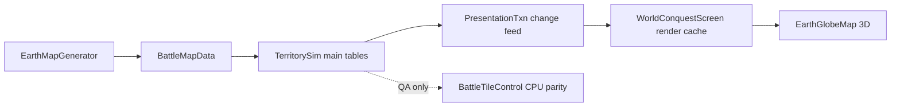

# Empires of Yesterday — Design & Dictionary

**Last updated:** June 9, 2026
**The game:** World Conquest — a fluid territory-conquest sim (Creeper World style) on a 360×180 Earth globe. This is the only game mode; all legacy modes (galaxy campaign, tactical squads, planet runs, RTS World prototype) were removed.

---

## 1. Core Fantasy

Two empires fight for Earth. Each side's power is a **fluid**: blue (friendly) and red (hostile) pressure pumped from a home capital, spreading across a height-mapped tile grid, cancelling on contact. There are no units — the territory itself is the army. You shape the war with infrastructure: **outposts** that pump pressure forward, and **land bridges** that open invasion routes and logistics roads across oceans.

The objective is **total conquest**: own every reachable claimable land tile, or grind the enemy's cumulative power to zero.

---

## 2. Run Loop

1. **Main Menu** → Play (random seed, or fixed seed via `RunState.run_seed`)
2. **World Conquest screen** — live sim on the 3D globe. Watch the fronts, manage Supply, place structures.
3. Battle ends on conquest / zero enemy power / `MAX_SIM_TIME_SEC` (2h sim) → Battle Over overlay → back to menu.

### Controls

| Input | Action |
|-------|--------|
| Right-drag | Orbit globe |
| Mouse wheel | Zoom (clamped 155–320 units) |
| Left-click | Place structure (when a build mode is armed) |
| **Outpost (400)** button | Arm outpost placement |
| **Land Bridge (250)** button | Arm bridge placement |
| **Inspect** | Tile inspector mode |
| **Pause** / **▶ x1** | Pause / cycle sim speed |
| Esc | Cancel build mode |

---

## 3. Key Terms & Mechanics Dictionary

| Term | Definition | Code Reference |
|------|------------|----------------|
| **Claimable tile** | Land tile reachable (BFS over passable cells) from either side's spawn, or part of a built bridge corridor. Only claimable tiles change ownership. | `BattleTileControl._is_claimable_index` |
| **Pressure** | Continuous per-tile influence (sim truth), one float array per side. Not capped by terrain height. | `BattleTileControl.pressure_friendly / pressure_hostile` |
| **Owners** | Discrete per-tile ownership: `0=neutral`, `1=friendly`, `2=hostile`, `3=contested`, `4=unclaimable`. | `BattleTileControl.owners` |
| **Effective height** | `H = pressure + terrain_elevation` (elevation 0–100, `HEIGHT_MAX`). Gradient flow equalizes `H` across neighbors — fluid pools in basins and only tops mountains when deep enough. | `BattleTileControl.effective_height` |
| **Gradient flow** | Per-round cardinal-neighbor flow: if `H_src − H_n > MIN_FLOW_DELTA`, move `∝ delta × FLOW_CONDUCTIVITY × edge_flow`, capped at `MAX_OUTFLOW_FRAC` of source per pass. Bridges use the same 2D flow ("Option A") — no special pipe restriction. | `BattleTileControl._gradient_flow_tile` |
| **Cancellation** | Overlapping friendly/hostile pressure subtract (`min` of both removed). | `_propagate_simple_water` |
| **Home pump** | Capital tile injects `HOME_START_POWER × (1 + force × 0.01)` × `WORLD_CONQUEST_PRESSURE_SCALE` (1/2000) per round. | `BattleTileControl.home_spawn_rate_for_force` |
| **Supply** | Player wallet. Starts at `STARTING_SUPPLY` (1200); income `INCOME_PER_TILE_PER_SEC` (0.8) per owned tile. Spent on outposts (400) and bridges (250). | `WorldConquestScreen`, `WorldConquestConfig` |
| **Outpost (spawner)** | Player-placed pressure pump. Lands on the exact clicked tile; placement is allowed on any land tile except enemy-held ones. Connects to the network by road, then builds for `OUTPOST_BUILD_SEC`; takes `OUTPOST_ENEMY_DPS` while building on hostile ground. | `WorldConquestOutpostBuild.gd`, `WorldConquestScreen._resolve_placement` |
| **Land bridge (corridor link)** | Water-only crossing from your network to a foreign coast. Built cells become claimable and conduct pressure (`BRIDGE_PRESSURE_FLOW_MULT` 0.92) and count as roads for logistics. | `nearest_corridor_path_to_target`, `bridge_corridors` |
| **Operational sources** | Route origins for new construction: home capital + active outposts + friendly bridge landings. | `WorldConquestOutpostBuild.operational_sources` |
| **Roads** | Built outpost paths + bridge corridors. Used by resource hauling and outpost linking. | `road_cells_for_team` |
| **Resource deposits** | Aurelium / Verdantite / Emberstone blobs scattered on matching terrain. When owned, a site links itself to the road network, then hauls yield pulses to the nearest hub. | `WorldConquestResources.gd`, `EarthMapGenerator._scatter_resource_blobs` |
| **Territory backend** | `rust` (default when GDExtension loaded), `gpu`, or `cpu`. Force with `BATTLE_TERRITORY_BACKEND`. All backends implement the same propagation; QA gates parity. | `BattleTerritoryRustBackend.gd`, `BattleTerritoryGpuField.gd` |
| **Replay tape** | Deterministic CPU resolve recorded as packed frames (owners + log-scale pressure codec v2), `record_stride` 4. Used by QA goldens; live play does not record. | `BattleTerritoryTape.gd`, `BattleReplayPack.gd` |

---

## 4. Terrain & Map

- **Source:** `data/earth/land_mask_360x180.png` + `elevation_360x180.png` (procedural fallback if missing).
- **Terrain types:** grass, water (impassable), mountain (elev > 0.72, slow flow ×~0.45, claimable), sand (low coast), mud.
- **Longitude wraps**; latitude does not.
- **Spawns:** player capital in the west third, enemy in the east third (seeded random land tile).
- Generated once per run by `EarthMapGenerator.generate(seed)`; land components precomputed by `WorldConquestOutpostBuild.prepare_land_components`.

---

## 5. Structures

### Outpost placement pipeline (`WorldConquestScreen._resolve_placement`)

1. **Precheck** — on map, on land, not enemy-held (`_placement_territory_reject`), min spacing 6 cells from structures and bridges.
2. **Routing** — `nearest_path_to_target` from operational sources: mainland BFS → infrastructure BFS (land + bridge cells) → land route from nearest bridge landing on the same landmass → greedy new bridge → A* (click only, not hover).
3. **Fallback** — if no route exists, the outpost is placed standalone (logged as a `RunLog` warning; it has no supply path).
4. **Construction** — road builds at `OUTPOST_ROAD_CELLS_PER_SEC`, then the outpost builds for `OUTPOST_BUILD_SEC`; only the building phase takes enemy damage.

### Land bridge pipeline

1. Click a foreign coast (snaps inland clicks to the nearest coastal cell).
2. `nearest_corridor_path_to_target` finds a water-only crossing; rejected if the route is overland.
3. Built cells join `bridge_corridors`, become claimable for both flow and invasion (`extend_beachhead_from_landing`), and join the road network.

---

## 6. Sim Architecture

### Authoritative model (60 FPS contract)

| Layer | Owns | Godot role |
|-------|------|------------|
| **Main tables (Rust)** | owners, pressure, structures, logistics built cells, agents | Never re-scanned every frame for paint |
| **PresentationTxn (Rust)** | deltas since last pull: owner cells, path_built patches, new road cells, marker dirty | Drained once/frame via `pull_presentation_txn` |
| **Render cache (GDScript)** | `placed_structures` dicts, MultiMesh instances, ownership texture | Apply txn only; full structure snapshot is rare (place/activate/destroy) |

- Live sim steps and logistics write **main tables** and append **transactions**.
- Visuals read **transactions**, not the whole world table.
- `BattleTileControl` / full snapshots remain for QA parity and rare rebuilds — not the live paint path.
- See `rust/empire_territory/src/presentation_txn.rs` and `PERFORMANCE.md`.

### Win / end conditions

- **Conquest** — one side owns all reachable claimable land (`CONQUEST_LAND_FRAC` = 1.0).
- **Zero power** — enemy cumulative pressure ≤ `ZERO_POWER_VICTORY_EPS`.
- **Time cap** — `MAX_SIM_TIME_SEC` (7200 sim-seconds).

---

## 7. QA & Parity (summary — see QA_LIFECYCLE.md)

- `qa_runner.tscn` — script/scene loads, world-map smoke, gradient flow goldens (downhill + synthetic mountain headroom), **Rust vs CPU owner parity (runs by default when the DLL is loaded)**.
- `bridge_invasion_smoke_test.gd` — coast snap, bridge corridors, outpost routing across bridges, Rust bridge pressure.
- `island_outpost_smoke_test.gd` — island placement routing.
- Optional env gates: `BATTLE_RUST_COMPARE=0` (skip parity), `BATTLE_RUST_BAKE_COMPARE=1`, `BATTLE_RUST_ACTIVE_COMPARE=1`, `BATTLE_WORLD_CONQUEST_BENCH=1`.

---

## 8. Quick Reference — Key Files

| Area | Primary Files |
|------|---------------|
| Screen / UI / placement | `WorldConquestScreen.gd` (+ `.tscn`), `WorldConquestConfig.gd` |
| Routing / outposts / bridges | `WorldConquestOutpostBuild.gd` |
| Resources / logistics | `WorldConquestResources.gd` |
| Sim driver | `BattleTerritorySim.gd` |
| Pressure & ownership (CPU truth) | `BattleTileControl.gd` |
| Rust backend bridge | `BattleTerritoryRustBackend.gd`, `rust/empire_territory/` |
| GPU backend | `BattleTerritoryGpuField.gd`, `shaders/territory/*.glsl` |
| Map generation | `EarthMapGenerator.gd`, `BattleMapData.gd` |
| Globe render | `EarthGlobeMap.gd`, `EarthGlobeMesh.gd` |
| Overlay / fluid visuals | `BattleTileOwnershipOverlay.gd`, `BattleTileFluidField.gd` |
| Replay / tape (QA) | `BattleTerritoryTape.gd`, `BattleReplayPack.gd`, `BattleReplayTape.gd` |
| Logging | `RunLog.gd` (autoload; writes `logs/latest_run.txt`) |

---

## 9. Maintenance Principles

- **Single source of truth** — this file is the canonical design reference; update it alongside mechanic changes.
- **Code is truth for numbers** — constants live in `WorldConquestConfig.gd` and `BattleTileControl.gd`; this doc explains the *why*.
- **Backend parity is a hard invariant** — any propagation change must land in GDScript *and* Rust (and GPU if applicable), gated by the QA parity check.
