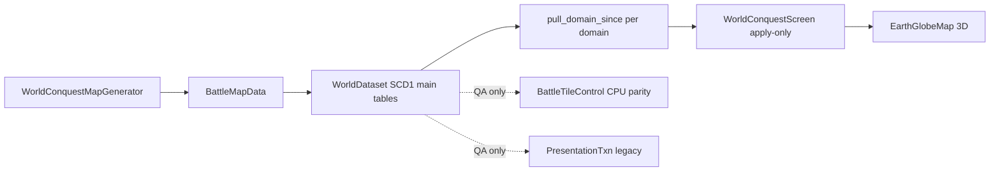

# Empires of Yesterday — Design & Dictionary

**Last updated:** July 10, 2026  
**The game:** World Conquest — a fluid territory-conquest sim (Creeper World style) on a 360×180 Earth globe, with multi-structure logistics and units. This is the only game mode; all legacy modes (galaxy campaign, tactical squads, planet runs, RTS World prototype) were removed.

---

## 1. Core Fantasy

Two empires fight for Earth. Each side's power is a **fluid**: blue (friendly) and red (hostile) pressure pumped from a home capital, spreading across a height-mapped tile grid, cancelling on contact. Territory is the primary army — but you also field **soldiers** and **bombers** from player-built **barracks** and **hangars**. You shape the war with infrastructure: **outposts** that pump pressure forward, **land bridges** that open invasion routes and logistics roads across oceans, and a **logistics road network** that links mines and structures. Strategic minerals (**Aurelium**, **Verdantite**, **Emberstone**) fund unit spawn and soldier upkeep.

The objective is **total conquest**: own every reachable claimable land tile, or grind the enemy's cumulative pressure to zero. Units and economy support the front; they do **not** change the win formula (see Design locks F5).

---

## 2. Run Loop

1. **Main Menu** → Play (random seed, or fixed seed via `RunState.run_seed`)
2. **World Conquest screen** — live sim on the 3D globe. Watch the fronts, manage Supply / minerals, place structures, field units.
3. Battle ends on conquest / zero enemy power / `MAX_SIM_TIME_SEC` (2h sim) → Battle Over overlay → back to menu.

### Controls

| Input | Action |
|-------|--------|
| Right-drag | Orbit globe |
| Mouse wheel | Zoom (clamped 155–320 units) |
| Left-click | Place structure (when a build mode is armed) |
| **Outpost (400)** | Arm outpost (spawner) placement |
| **Barracks (400)** | Arm barracks placement — spawns soldiers |
| **Hangar (400)** | Arm hangar placement — spawns bombers |
| **Land Bridge (250)** | Arm bridge placement |
| **Inspect** | Tile inspector mode |
| **Pause** / **▶ x1** | Pause / cycle sim speed |
| Esc | Cancel build mode |
| F3 | Toggle perf HUD (see PERFORMANCE.md) |

---

## 3. Key Terms & Mechanics Dictionary

| Term | Definition | Code Reference |
|------|------------|----------------|
| **Claimable tile** | Land tile reachable (BFS over passable cells) from either side's spawn, or part of a built bridge corridor. Only claimable tiles change ownership. | `BattleTileControl._is_claimable_index` |
| **Pressure** | Continuous per-tile influence (sim truth), one float array per side. Not capped by terrain height. | `BattleTileControl.pressure_friendly / pressure_hostile` |
| **Owners** | Discrete per-tile ownership: `0=neutral`, `1=friendly`, `2=hostile`, `3=contested`, `4=unclaimable`. | `BattleTileControl.owners` |
| **Effective height** | `H = pressure + terrain_elevation` (elevation 0–100, `HEIGHT_MAX`). Gradient flow equalizes `H` across neighbors — fluid pools in basins and only tops mountains when deep enough. | `BattleTileControl.effective_height` |
| **Gradient flow** | Per-round cardinal-neighbor flow: if `H_src − H_n > MIN_FLOW_DELTA`, move `∝ delta × FLOW_CONDUCTIVITY × edge_flow`, capped at `MAX_OUTFLOW_FRAC` of source per pass. Bridges use the same 2D flow ("Option A") — no special pipe restriction. | `BattleTileControl._gradient_flow_tile` |
| **Cancellation** | Overlapping friendly/hostile pressure subtract (`min` of both removed). | `_propagate_simple_water` |
| **Home pump** | Capital tile injects `HOME_START_POWER × (1 + force × 0.01)` × `WORLD_CONQUEST_PRESSURE_SCALE` (1/2000) per inject interval. | `BattleTileControl.home_spawn_rate_for_force` |
| **Supply** | Player wallet. Starts at `STARTING_SUPPLY` (1200); income `INCOME_PER_TILE_PER_SEC` (0.8) per owned tile. Spent on outposts (400), barracks (400), hangars (400), and bridges (250). | `WorldConquestScreen`, `WorldConquestConfig`, `EconomyCatalog` |
| **Outpost (spawner)** | Player-placed pressure pump. Lands on the exact clicked tile; placement is allowed on any land tile except enemy-held ones. Connects to the network by road, then builds for `OUTPOST_BUILD_SEC`; takes `OUTPOST_ENEMY_DPS` while building on hostile ground. | `WorldConquestOutpostBuild.gd`, `WorldConquestScreen._resolve_placement` |
| **Barracks** | Supply cost 400; build `BARRACKS_BUILD_SEC` (**5 s**, same as outpost). Spawns **soldiers** every `BARRACKS_SPAWN_INTERVAL_SEC` (10 s) for Aurelium (`SOLDIER_SPAWN_AURELIUM_COST` = 3). Cap **5** living per barracks; global soldier cap **100**. | `EconomyCatalog`, `world_session.rs`, `agents.rs` |
| **Hangar** | Supply cost 400; build `HANGAR_BUILD_SEC` (**5 s**, same as outpost). Spawns **bombers** every `HANGAR_SPAWN_INTERVAL_SEC` (10 s) for Aurelium (`BOMBER_SPAWN_AURELIUM_COST` = 3). Cap **5** living per hangar; global bomber cap **100**. | `EconomyCatalog`, `world_session.rs`, `bombers.rs` |
| **Soldier** | Ground unit: aura pressure + erode enemy pressure; moves on land/infra. **Aurelium upkeep** `SOLDIER_UPKEEP_AURELIUM_PER_SEC` (0.15); deficit applies `SOLDIER_UPKEEP_DEFICIT_DPS`. Orphan damage if barracks destroyed. | `WorldConquestConfig`, `agents.rs` |
| **Bomber** | Air unit: bombs enemy infrastructure/pressure. **No Aurelium upkeep** (spawn cost only) — intentional (Design lock A14). | `bombers.rs`, `EconomyCatalog` units.bomber |
| **Land bridge (corridor link)** | Water-only crossing from your network to a foreign coast. Built cells become claimable and conduct pressure (`BRIDGE_PRESSURE_FLOW_MULT` = **2.8**) and count as roads for logistics. | `nearest_corridor_path_to_target`, `bridge_corridors`, `WorldConquestConfig` |
| **Operational sources** | Route origins for new construction: home capital + active outposts + friendly bridge landings. | `WorldConquestOutpostBuild.operational_sources` |
| **Roads / logistics** | Shared per-team logistics network: timer road growth, strain, path completion. Authority lives in Rust `logistics.rs` under WorldDataset (not presentation builder bots). | `logistics.rs`, `WorldConquestConfig.LOGISTICS_*` |
| **Logistics strain** | Burst + ongoing drain from active structures scales an **effective inject / output mult** (`1 / (1 + strain × sensitivity)`). Effect can be subtle in play — intentional for now (Design lock F3). | `logistics.rs` `effective_output_mult` |
| **Resource deposits** | Aurelium / Verdantite / Emberstone blobs. When owned, a site links to the road network, then hauls yield pulses to the nearest hub. Visual pulses capped at `RESOURCE_MAX_VISUAL_PULSES` (36); economy still full credit (Design lock F7). | `WorldConquestResources.gd`, `WorldConquestMapGenerator._scatter_resource_blobs` |
| **WorldDataset** | Live authority contract: Rust owns grid, structures, world-session tick, builder/logistics, and resource wallet. Godot presentation is apply-only. All `WORLD_DATASET_*` flags must be true for Play. | `WorldConquestConfig.world_dataset_live()`, `WorldDatasetAssert.gd` |
| **SCD1 domain pulls** | Live paint: per-domain monotonic versions; Godot `pull_domain_since` full current rows with `version > last`. Full dump only at start / allow-listed gap recovery. | `domain_version.rs`, `Scd1DomainPull.gd`, `docs/REQUEST_SCD1_VERSIONED_PULL.md` |
| **PresentationTxn (legacy/QA)** | Old change feed — **not** the live Play path after SCD1 cutover. | `presentation_txn.rs` (QA only) |
| **Territory backend** | Live World Conquest requires **Rust** GDExtension. `gpu` / `cpu` remain for QA parity and harnesses — not product live path when WorldDataset is on. Force with `BATTLE_TERRITORY_BACKEND` only in tests. | `BattleTerritoryRustBackend.gd` |
| **Replay tape** | Deterministic CPU resolve recorded as packed frames (owners + log-scale pressure codec v2), `record_stride` 4. Used by QA goldens; live play does not record. | `BattleTerritoryTape.gd`, `BattleReplayPack.gd` |

---

## 4. Terrain & Map

- **Source:** `data/earth/land_mask_360x180.png` + `elevation_360x180.png` (procedural fallback if missing), via map catalog definitions.
- **Terrain types:** grass, water (impassable), mountain (elev > 0.72, slow flow ×~0.45, claimable), sand (low coast), mud.
- **Longitude wraps**; latitude does not.
- **Spawns:** player capital in the west third, enemy in the east third (seeded random land tile) for default Earth spawn mode.
- **Primary generator:** `WorldConquestMapGenerator.generate(map_id, seed)` — real map gen (land bits, elevation, coasts, spawns, resource scatter).
- **`EarthMapGenerator.generate(seed)`** is a **back-compat wrapper** that calls `WorldConquestMapGenerator.generate(DEFAULT_MAP_ID, seed)`. Prefer the World Conquest generator in new code.
- Land components precomputed by `WorldConquestOutpostBuild.prepare_land_components`.

---

## 5. Structures & Units

### Structure kinds (`EconomyCatalog` / `structures.rs`)

| Kind | Supply | Build | Role |
|------|--------|-------|------|
| Outpost (`spawner`) | 400 | `OUTPOST_BUILD_SEC` (5 s) after road | Pressure pump |
| Barracks | 400 | 5 s | Spawns soldiers (Aurelium) |
| Hangar | 400 | 5 s | Spawns bombers (Aurelium) |
| Land Bridge (`corridor_link`) | 250 | road/corridor only | Water crossing + road |

### Outpost / barracks / hangar placement (`WorldConquestScreen._resolve_placement`)

1. **Precheck** — on map, on land, not enemy-held (`_placement_territory_reject`), min spacing 6 cells from structures and bridges.
2. **Routing** — `nearest_path_to_target` from operational sources: mainland BFS → infrastructure BFS (land + bridge cells) → land route from nearest bridge landing on the same landmass → greedy new bridge → A* (click only, not hover).
3. **Fallback (player only)** — if no route exists for an outpost, the outpost is placed **standalone** (logged as a `RunLog` warning; it has no supply path). Design lock F2.
4. **Construction** — logistics / road growth, then structure build phase; building phase takes enemy damage.

### Land bridge pipeline

1. Click a foreign coast (snaps inland clicks to the nearest coastal cell).
2. `nearest_corridor_path_to_target` finds a water-only crossing; rejected if the route is overland.
3. Built cells join `bridge_corridors`, become claimable for both flow and invasion (`extend_beachhead_from_landing`), and join the road network.

### Units (summary)

- **Soldiers** — per-barracks cap 5, global 100; spawn cost Aurelium 3; upkeep Aurelium 0.15/s; aura + shoot erode.
- **Bombers** — per-hangar cap 5, global 100; spawn cost Aurelium 3; **no continuous upkeep**; bomb power / interval from config.
- Caps and costs: Design lock F6; numbers live in `WorldConquestConfig.gd`.

---

## 6. Sim Architecture

### WorldDataset authority + SCD1 versioned domain pulls

Live Play is a **single-source WorldDataset** in Rust with **SCD1** current-state tables and **per-domain monotonic pulls** (see `docs/REQUEST_SCD1_VERSIONED_PULL.md`). When `WorldConquestConfig.world_dataset_live()` is true (all flags):

| Flag | Meaning |
|------|---------|
| `WORLD_DATASET_GRID_AUTHORITY` | Owners / pressure / claimable live in Rust; GDScript grid mirror frozen for paint |
| `WORLD_DATASET_STRUCTURE_AUTHORITY` | Structure store is Rust; `placed_structures` is a render cache |
| `WORLD_DATASET_WORLD_SESSION_TICK` | Build timers, construction damage, barracks/hangar spawns tick in Rust |
| `WORLD_DATASET_BUILDER_AUTHORITY` | Logistics owns road growth (builder bots are presentation legacy) |
| `WORLD_DATASET_RESOURCE_WALLET` | Mineral wallet / haul credit authority in Rust |

**Apply-only contract:**

| Layer | Owns | Godot role |
|-------|------|------------|
| **Main tables (Rust)** | owners, pressure, structures, logistics built cells, agents, bombers, wallets | Never re-scanned every frame for paint |
| **Domain pull (Rust)** | rows with `version > last` per domain (structures, territory, roads, agents, bombers, wallet) | `pull_domain_since` + `Scd1DomainPull` once/frame |
| **PresentationTxn** | legacy change feed | QA/goldens only — not live paint |
| **Render cache (GDScript)** | `placed_structures` dicts, MultiMesh roads, ownership texture, unit dots | Overwrite from domain pulls; full domain seed at start / allow-listed gap only |

- Live sim steps and logistics write **main tables** and bump **domain versions**.
- Visuals **pull rows with version > last** per domain (`Scd1DomainPull`), not PresentationTxn.
- Wallet income/spend under live is **Rust apply_resource_tick_delta** (then pull mirror) — Godot does not author absolute balances.
- `BattleTileControl` / PresentationTxn remain for QA parity — not the live paint path.
- See `docs/REQUEST_SCD1_VERSIONED_PULL.md`, `domain_version.rs`, `Scd1DomainPull.gd`, `WorldDatasetAssert.gd`, and `PERFORMANCE.md`.

### Win / end conditions

- **Conquest** — one side owns all reachable claimable land (`CONQUEST_LAND_FRAC` = 1.0).
- **Zero power** — enemy cumulative pressure ≤ `ZERO_POWER_VICTORY_EPS`.
- **Time cap** — `MAX_SIM_TIME_SEC` (7200 sim-seconds).
- Units do **not** alter this formula (Design lock F5).

---

## 7. Design locks

Product choices locked for the current ship target (code may implement them as intentional asymmetry). Do not “fix” these without an explicit design change.

| ID | Lock |
|----|------|
| **A13 / F1** | Enemy AI places **outposts + land bridges only** (no barracks / hangar AI). Intentional asymmetry for now. |
| **A14** | **Bombers have no Aurelium upkeep**; soldiers have upkeep. Intentional. |
| **F2** | **Standalone outpost fallback** allowed for the **player only** when no route exists; logged as a `RunLog` warning. |
| **F3** | **Logistics strain** affects inject / output mult; may be subtle to the player — intentional for now. |
| **F4** | **Builder bots** are presentation legacy; **logistics** owns roads under live WorldDataset authority. (**Direction:** roads may be removed — see DESIGN.md § Direction — roads likely removed.) |
| **F5** | Win is **land conquest** or **zero enemy pressure**; units do not alter the win formula. |
| **F6** | Cap **5** living units per barracks/hangar structure; global **100** soldiers and **100** bombers. |
| **F7** | Resource haul **visuals** capped (`RESOURCE_MAX_VISUAL_PULSES`); economy still gets **full credit**. |

### Direction — roads likely removed (open)

**Intent (2026-07-22):** Cell-path **roads are not working out** and will probably be **removed entirely**. Ground-unit reach beyond local movement will move to a **teleport / projection** concept instead of road networks. Candidate shapes (undecided):

- **Air-drop ships** (or similar projection vehicles), and/or
- A **teleporting building** / gate structure

Until that lands: keep current logistics/roads code as living authority; do not invest heavily in further road-path polish except critical play blockers. Land bridges may still matter for **pressure / claimable ocean crossings** even if road ribbons go away — revisit when the teleport design is chosen.

---

## 8. Godot version story (C12 / G2)

| Layer | Version | Notes |
|-------|---------|-------|
| **Project features** | `config/features` includes **4.7** in `project.godot` | Feature tag for the project file |
| **Editor / tooling** | Editor metadata may list 4.3; day-to-day QA docs reference **Godot 4.6+** (e.g. Steam tools build) | Prefer the editor build you use for QA |
| **Rust GDExtension** | gdext `master` aimed at latest Godot 4.x (incl. 4.6+) | Rebuild DLL after engine upgrades (`setup_rust.ps1`) |

**Practical target:** develop and QA on **Godot 4.6+** with a matching rebuilt `empire_territory` DLL. The 4.7 feature tag and older editor field are historical project metadata — do not assume three different product targets. See [docs/INDEX.md](docs/INDEX.md).

---

## 9. QA & Parity (summary — see QA_LIFECYCLE.md)

- `qa_runner.tscn` — script/scene loads, world-map smoke, gradient flow goldens, **Rust vs CPU owner parity (when the DLL is loaded)**, WorldDataset asserts.
- `bridge_invasion_smoke_test.gd` — coast snap, bridge corridors, outpost routing across bridges, Rust bridge pressure.
- `island_outpost_smoke_test.gd` — island placement routing.
- `barracks_smoke_test.gd` — barracks soldier spawn + orphan damage.
- Optional env gates: `BATTLE_RUST_COMPARE=0` (skip parity), `BATTLE_RUST_BAKE_COMPARE=1`, `BATTLE_RUST_ACTIVE_COMPARE=1`, `BATTLE_WORLD_CONQUEST_BENCH=1`.

---

## 10. Quick Reference — Key Files

| Area | Primary Files |
|------|---------------|
| Screen / UI / placement | `WorldConquestScreen.gd` (+ `.tscn`), `WorldConquestConfig.gd` |
| Routing / outposts / bridges | `WorldConquestOutpostBuild.gd` |
| Economy catalog | `EconomyCatalog.gd`, `EconomyLib.gd` |
| Resources / logistics (GDScript face) | `WorldConquestResources.gd` |
| Enemy AI | `EnemyStrategy.gd` |
| Sim driver | `BattleTerritorySim.gd` |
| Pressure & ownership (CPU truth / QA) | `BattleTileControl.gd` |
| Rust backend bridge | `BattleTerritoryRustBackend.gd`, `rust/empire_territory/` |
| GPU backend (non-live WC) | `BattleTerritoryGpuField.gd`, `shaders/territory/*.glsl` |
| Map generation | `WorldConquestMapGenerator.gd` (primary), `EarthMapGenerator.gd` (wrapper), `BattleMapData.gd` |
| WorldDataset QA | `WorldDatasetAssert.gd` |
| Globe render | `EarthGlobeMap.gd`, `EarthGlobeMesh.gd` |
| Overlay / fluid visuals | `BattleTileOwnershipOverlay.gd`, `BattleTileFluidField.gd` |
| Replay / tape (QA) | `BattleTerritoryTape.gd`, `BattleReplayPack.gd`, `BattleReplayTape.gd` |
| Logging | `RunLog.gd` (autoload; writes `logs/latest_run.txt`) |

---

## 11. Maintenance Principles

- **Single source of truth** — this file is the canonical design reference; update it alongside mechanic changes.
- **Code is truth for numbers** — constants live in `WorldConquestConfig.gd` and `BattleTileControl.gd` / Rust kernels; this doc explains the *why*.
- **WorldDataset + SCD1 domain pulls** — live authority is Rust; presentation is versioned apply-only (PresentationTxn not live).
- **Backend parity is a hard invariant** for QA CPU/Rust paths — any propagation change must land in GDScript *and* Rust (and GPU if applicable), gated by the QA parity check.
- **Design locks** above are product choices; document changes here before “fixing” intentional asymmetry.
