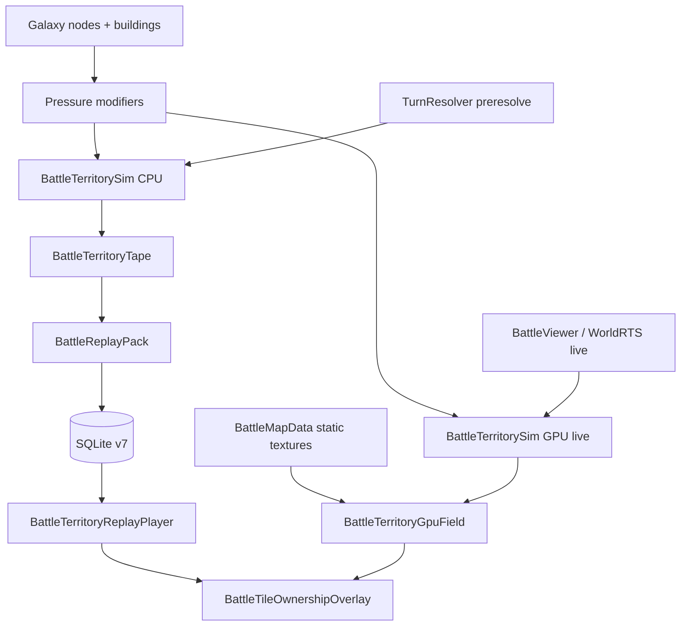

# Empires of Yesterday — Design & Dictionary

**Last updated:** May 27, 2026  
**Primary experience:** Commander galaxy campaign with territory-conquest battles (Creeper World 4 style).

---

## 1. Core Fantasy

You are an **orbital commander** overseeing a lost colony reclamation: drop squads, assign **sectors**, evolve broken builds mid-run, kill the **Overmind**, and extract before cataclysm — **without pausing the battlefield**.

The visual and mechanical heart of each battle is a living fluid front: two colors of pressure (blue friendly, red hostile) spread across a height-mapped tile grid. The objective is total conquest of all reachable claimable tiles. There are no units on the replay map — only the territory itself.

---

## 2. Run Loop & Modes

### Galaxy map node previews
Each conquest node on `GalaxyMapScreen` draws a **circular minimap** of the deterministic battle terrain (`GalaxyNodeMapPreview`, same seed as `BattleMapGenerator`). HQ nodes keep the solid icon. Textures are cached per run and built incrementally on load.

### Commander Mode (default, current)
1. **Main Menu** → New Planet Run (or Daily Seed Run)
2. **Orbital Carrier** — configure squads, loadouts, traits, stances, mutators
3. **Launch** → **Navigation** (branching DAG): pick path through combat / elite / boss sectors
4. Each node triggers a **territory conquest battle** (height-biased pressure propagation)
5. After combat: sector reward (evolution, heal, biomass)
6. Continue until **Overmind Sanctum** (boss) → **Run Summary** → Meta progression (ascension, codex)

Controls: W/S/Enter to navigate; real-time combat (no global pause); SPACE = sector overlay.

### Legacy Modes (Main Menu → More…)
- **Legacy 4-op run** — linear ops with Between-Op Hub (pre-V2 squad system)
- **Legacy planet run** — single persistent 12–16 room facility (pre-V2)

These remain for compatibility but are not the primary experience.

---

## 3. Key Terms & Mechanics Dictionary

Alphabetical glossary with precise definitions and code references.

| Term | Definition | Code Reference |
|------|------------|----------------|
| **Claimable tile** | A land tile that is passable, not water, and within at least one side's reachability mask (BFS from spawn zones). Only claimable tiles can change ownership. | `BattleTileControl._is_claimable_index`, `BattleMapData.is_land_cell` + `is_passable` |
| **Fluid front** | The visual boundary where friendly and hostile pressure meet and compete. Rendered as a soft blended band in the replay overlay. | `BattleTileFluidField.build_fluid_image`, `BattleTileOwnershipOverlay` |
| **Height (tile_height)** | Terrain elevation **0–100** in sim (`HEIGHT_MAX`; mountains = 100). Stored 0.0–1.0 in map JSON. **Pressure is not capped by height** — a tile may hold 10,000+ power. Gradient flow uses effective height `H = pressure + elevation`. | `BattleTileControl.tile_elevation`, `BattleMapGenerator` |
| **Owners (`sim_owners`)** | Discrete per-tile ownership from the sim: `0=neutral`, `1=friendly`, `2=hostile`, `3=contested`, `4=unclaimable`. **Tape stores raw sim owners** (no soften at record). | `BattleTileControl.owners`, `BattleTerritoryTape` |
| **Display owners** | Soften/blur applied **only at playback** in the viewer overlay (`soften_owners_for_display`). | `BattleTileFluidField.gd`, `BattleTileOwnershipOverlay.gd` |
| **record_stride** | Record one tape frame every N sim rounds (default **4**). Sim still advances every round. | `BattlePacing.RESOLVE_TAPE_RECORD_STRIDE`, `BattleTerritorySim.build_replay_tape` |
| **resolve_ms** | Wall-clock milliseconds to build the territory replay tape during pre-resolve or viewer fallback. | `BattleTerritoryTape.resolve_ms`, battle queue entry |
| **end_reason** | Why the sim stopped: `conquest`, `dominance`, `cap`, or `stall`. | `BattleTerritorySim.get_result()` |
| **Pressure (friendly / hostile)** | Continuous influence per tile (sim truth). Keyframes every `2 × record_stride` on tape; log-scale **codec v2** (`MAX_PRESSURE_V2` ≈ 10k) or legacy linear v1 (≈96). Replay lerps between keyframes. | `BattleTileControl.pressure_*`, `BattleTilePressureCodec`, `BattleTileFluidField` |
| **Propagation** | The per-round simulation step that updates pressure (emit + diffuse + cancel) and resolves ownership flips. Runs inside `BattleTerritorySim.advance_round`. | `BattleTileControl.propagate_round_territory`, `BattleTerritorySim.advance_round` |
| **Resolve mode** | String stored with each battle entry: `"territory"` (current) or `"tactical"` (legacy unit-based). Determines which SQL path and replay system to use. | `TurnResolver.preresolve_commander_battle` → `resolve_mode: "territory"`, `BattleSqlReplay.load_from_db` |
| **Building pressure bonus** | Pre-battle strategic buildings placed on galaxy nodes provide starting pressure modifiers to the player side. Applied once at sim setup. | `BuildingDefinition.pressure_bonus` (barracks 0.14, forge 0.10, sensor_array 0.08, field_hospital 0.06), `BattleTerritorySim._pressure_mods_from_galaxy`, `BattleTileControl.apply_building_modifiers` |
| **Win condition (territory)** | One side owns **all reachable claimable tiles**. Checked each round after propagation. | `BattleTerritorySim._check_conquest`, `get_result` → `player_won` |
| **Allocation losses (territory)** | Post-battle losses calculated from fraction of claimable tiles held at end (not from unit KIA). | `BattleTerritorySim.allocation_losses` |
| **Creeper simple water model** | Optional cheaper simulation mode (for testing) where home bases are the dominant continuous power sources; owned territory emits lightly; power cancels on overlap. | `BattleTileControl.use_simple_water_model`, `_propagate_simple_water` |
| **Territory backend** | `cpu` or `gpu` sim driver for one battle instance. Resolve/tape always `cpu`; live Engage and RTS World default `gpu`. | `BattleTerritorySim.backend`, `BATTLE_TERRITORY_BACKEND` env |
| **GPU territory field** | Ping-pong `R32F` pressure textures + static map textures on `RenderingDevice`; owner map `R8` for display and readback. | `BattleTerritoryGpuField.gd`, `shaders/territory/*.glsl` |
| **Sim truth (live)** | During live Engage / RTS World, pressure and ownership for rendering live on GPU textures (not full-grid CPU arrays each frame). | `BattleTerritoryGpuField`, `BattleTileOwnershipOverlay.enable_gpu_sim_mode` |
| **Sim truth (resolve)** | Headless pre-resolve and tape encoding use CPU `BattleTileControl` arrays (deterministic, QA-gated). | `BattleTerritorySim.build_replay_tape` |
| **Display-only GPU mode** | Legacy live path: CPU sim packs R8 textures each overlay tick; fragment shader only tints. Superseded by **GPU sim mode** for large maps. | `BattleTileOwnershipOverlay.apply_live_state` |

---

## 4. Territory Conquest System (Current Primary Battle Mode)

### Win Condition
Control every reachable claimable tile. The first side to achieve this wins. If the round limit is hit without total conquest, the side with more tiles wins (tie broken by player).

### Height and Hydrostatic Flow
- Height is generated once per battle map (ridges + noise) and stored in `tile_height` (0–100 in sim via `HEIGHT_MAX`).
- **Simple water path:** effective height `H = pressure + elevation`. Gradient flow moves fluid from higher `H` to lower `H`, so connected basins settle to the same level.
- **Legacy tactical path:** `_diffuse_pressure_height_biased` still uses separate uphill/downhill weights.
- Water and mountains remain unclaimable regardless of height.

### Pre-Battle Building Modifiers
Galaxy nodes may have buildings. At `BattleTerritorySim.setup`, the sim reads the galaxy state and calls `tile_control.apply_building_modifiers(building_mods)`. Each building type adds a one-time pressure bonus to the player's starting state. This is the only way buildings affect battles.

### Propagation Rules (High Level — simple water / territory path)
1. **Emission** — Each round, the **home-base tile only** gains `spawn_rate` pressure. Formula: `HOME_START_POWER × (1 + committed_units × 0.01 + galaxy_bonus)` (e.g. 1 unit → 10,000 × 1.01 = 10,100). Battle start uses the same rate as the first injection. Rest of map starts at 0 — not half-map fill.
2. **Gradient flow** — Effective height `H = pressure + terrain_elevation`. For each cardinal neighbor, if `H_source > H_neighbor` by more than `MIN_FLOW_DELTA`, flow `∝ (H_source − H_neighbor) × FLOW_CONDUCTIVITY`, capped so at most `MAX_OUTFLOW_FRAC` of source pressure leaves per pass. Two passes per round. Connected low areas equalize (settling).
3. **Cancellation** — Overlapping friendly/hostile pressure cancel (`min` of both removed).
4. **Flip** — Simple water: ownership synced from tile pressures (`pf > ph × tile_ratio` and `pf ≥ MIN_CLAIM_PRESSURE` (0.04)). Base `tile_ratio` is 1.15; scaled per tile by `terrain_defense` and cover. Home tiles stay owned each round. No sim-side dust cutoff — weak pressure can linger and accumulate.

Tuning constants live in `BattleTileControl`:
- `FLOW_CONDUCTIVITY` (0.32) — base fraction of positive effective-height difference moved per edge per pass; multiplied by per-tile `terrain_move_cost` (mud/sand/mountain slow spread; grass normal).
- `MIN_FLOW_DELTA` (0.1) — ignore sub-threshold height differences (no micro-ripples).
- `MAX_OUTFLOW_FRAC` (0.5) — max share of tile pressure that may leave in one pass.
- `HEIGHT_MAX` (100) — mountain peak terrain height; `tile_elevation()` = `tile_height × 100`.
- `MIN_CLAIM_PRESSURE` (0.04) — ignore trace pressure for ownership; replay visuals fade faint fluid separately.
- `PRESSURE_UNIT_PUSH`, `PRESSURE_DECAY`, `FLIP_THRESHOLD`, `MAX_FLIPS_PER_ROUND` (legacy path)

### Data Model (Per Battle)
- `owners: PackedByteArray` — discrete ownership per tile (recorded each frame)
- `pressure_friendly / pressure_hostile` — sim floats; encoded per frame as `pressure_f` / `pressure_h` uint8 blobs (`BattleTilePressureCodec`, max ≈96)
- `tile_height: PackedFloat32Array` — static elevation (persisted in map snapshot)
- Reachability masks computed once from spawn zones (land only)

Recorded frames: `tile_owners`, quantized `pressure_f` + `pressure_h`, round index, tile counts. No unit state is stored or rendered.

### Live Engage (galaxy)

**Engage** from the galaxy map runs **live territory sim** in `BattleViewer`: `advance_round()` each tick. **GPU sim mode** (default when `BATTLE_TERRITORY_BACKEND=gpu`): pressure spread runs on the GPU (`BattleTerritoryGpuField`); `shaders/battle_territory_fluid.gdshader` samples sim textures directly—no per-frame `apply_live_state` full-grid CPU loop. Turn-queue and SQLite paths still use pre-resolved **replay tape** (CPU resolve). Set `BATTLE_TERRITORY_BACKEND=cpu` to force legacy CPU live sim (discouraged for maps larger than 96×72).

### RTS World (prototype)

**Main Menu → RTS World (live map)** uses the same **GPU territory backend** for spread. Strategic **wallet / income / spawner placement** stay on CPU; only hydrostatic propagation moves to GPU. See `WorldRTSScreen.gd`, `WorldRTSConfig.gd`.

### §4.1 Territory Resolve & Performance (CPU)

- **Sim truth vs display truth** — Tape stores **raw** `owners` from `BattleTileControl` (no `soften_owners_for_display` at record). Viewer / overlay soften at draw time for **replay** playback.
- **Resolve pipeline** (per round, CPU): home inject → gradient flow (1–2 passes) → pressure cancel → `_sync_ownership_from_pressures` → home preserve. Optional second gradient pass when frontier tile delta &gt; ε.
- **Recording** — `record_stride` default **4**; pressure keyframes every `2 × record_stride`; `resolve_ms` on tape; `end_reason` on result.
- **End policy** — Conquest, **92%** map share held 10 rounds (`dominance`), **decisive** (≥64% tiles + ≥2.4× committed troops for 12 rounds), stall, or round cap. `SPAWN_MULTIPLIER_PER_UNIT` 0.01 (HUD “home pump” = `1 + troops×0.01`).
- **Replay pacing (Option D)** — After sim, **`bake_display_frames()`** pre-renders display frames. Watch time at 1× tracks **sim round count** (~0.42s/round, clamped 45s–4800s), not a fixed 90s window. Viewer stall end uses **200** quiet rounds (queue 20). Legacy live-rebuild if bake missing.
- **Fluid alpha** — `pow(pressure / FLUID_ALPHA_PRESSURE_MAX, 0.48)` with **`FLUID_ALPHA_PRESSURE_MAX = 100_000`** in `BattleTileFluidField.gd` (both alpha paths).
- **Targets** — Standard 96×72 resolve &lt; 3 s; see [PERFORMANCE.md](PERFORMANCE.md) § Territory conquest resolve.

### Replay Storage (SQLite v7)
Territory battles store one row in `battle_territory_replay` (`tape_blob`): columnar packed binary (`BattleReplayPack`, magic `EYTR`). One `SELECT` loads the full tape. Legacy per-frame `battle_tile_frames` rows are still read if present.

### §4.2 GPU live territory sim

**When GPU is used**

- `BattleViewer` live Engage (`_tick_live_battle`)
- `WorldRTSScreen` continuous sim
- **Not** used for: `build_replay_tape`, turn-queue preresolve, `BattleTerritoryReplayPlayer`, headless `resolve_ms` QA gates

**Per-round GPU pipeline** (maps to CPU `_propagate_simple_water`)

1. **Inject** — home tiles (`player_home_grid` / `enemy_home_grid`), placed spawners, spawn rates from force + building mods.
2. **Flow friendly** — gather cardinal pass: `H = pressure + elevation`, `FLOW_CONDUCTIVITY`, `MIN_FLOW_DELTA`, `MAX_OUTFLOW_FRAC`, terrain flow mult texture.
3. **Flow hostile** — same on hostile ping-pong buffer.
4. **Cancel** — per-texel subtract `min(pf, ph)` from both.
5. **Ownership** — write `owner_map` R8 using `MIN_CLAIM_PRESSURE` and dominance ratio × per-tile claim mult.
6. **Preserve homes** — force friendly/hostile owner on home grid cells after ownership pass.

**Static uploads (once per map load)**

- `claimable` (R8), `elevation` (R32), `flow_mult` (R32), `claim_mult` (R32) derived from `BattleTileControl.setup` logic.

**Readback policy**

- Do **not** read full pressure textures each frame.
- Read `owner_map` (or tile counts) on a throttled interval for HUD, wallet, and `_check_conquest` (every round on 96×72; every 4 rounds on larger maps).
- Win/stall/domination logic remains in `BattleTerritorySim` using mirrored `friendly_tiles` / `hostile_tiles`.

**Parity / QA**

- Optional `BATTLE_GPU_COMPARE=1`: run N rounds CPU vs GPU on fixed 96×72 seed; assert owner/pressure divergence under epsilon.
- Tape golden tests and `resolve_ms < 3000` gate remain **CPU-only**.

**Parallel optimization (not GPU sim)**

- `WorldRTSScreen._draw_terrain` still uses per-tile `ColorRect` nodes for non-grass cells; baking to a single terrain texture or TileMap is recommended for RTS frame time independent of §4.2.

---

## 5. Data Flow & Persistence

- `resolve_mode: "territory"` stored in battle entry.
- `GameDatabase` schema v7: one packed `tape_blob` per battle (fast load).
- Legacy per-frame SQL rows still load via fallback path.
- Legacy tactical replays still work via the old unit-based SQL path when `resolve_mode != "territory"` or unit rows exist.

---

## 6. Legacy Tactical System

The original unit-based `BattleTacticalSim` + `UnitSimulationStore` + MultiMesh replay remains in the codebase for:
- QA tests that explicitly target the old path
- Old database rows that still contain unit state

It is **not** used for new commander battles. `TurnResolver.preresolve_commander_battle` now creates territory entries.

---

## 7. Design Principles & Maintenance

- **Single source of truth** — `DESIGN.md` is the canonical reference for game fantasy, current mechanics, terminology, and flows.
- **Update first** — When implementing or changing any mechanic, update this file before or alongside the code change.
- **Glossary discipline** — Keep entries crisp and precise. Link to source files for implementation details rather than duplicating code.
- **Other docs** — `README.md`, `EMPIRE_VISION.md`, `V2_ROADMAP.md`, and `PERFORMANCE.md` may reference or link to `DESIGN.md` but should not duplicate detailed mechanics.
- **Versioning** — The "Last updated" date at the top indicates the last significant design change. Minor wording fixes do not require a date bump.

---

## 8. Quick Reference — Key Files

| Area | Primary Files |
|------|---------------|
| Territory sim | `BattleTerritorySim.gd`, `BattleTerritoryTape.gd`, `BattleTerritoryReplayPlayer.gd` |
| Pressure & ownership | `BattleTileControl.gd` (propagation, height bias, building mods) |
| Map data | `BattleMapData.gd` (`tile_height`), `BattleMapGenerator.gd` (height gen) |
| Persistence | `GameDatabase.gd` (schema **v7**), `BattleSqlPersist.gd`, `BattleSqlReplay.gd`, `BattleReplayPack.gd` |
| Pacing / perf | `BattlePacing.gd`, `BattlePerfProfiler.gd` |
| Codec | `BattleTilePressureCodec.gd` |
| Viewer | `BattleViewer.gd` (no units), `BattleTileOwnershipOverlay.gd`, `BattleTileFluidField.gd` |
| GPU live sim | `BattleTerritoryGpuField.gd`, `shaders/territory/*.glsl` |
| RTS World | `WorldRTSScreen.gd`, `WorldRTSConfig.gd`, `WorldMapGenerator.gd` |
| Turn entry | `TurnResolver.gd` (territory path) |
| Buildings | `BuildingDefinition.gd` (`pressure_bonus`) |

---

*This document is intentionally concise. Implementation details live in the referenced `.gd` files. When in doubt, the code is the source of truth; this document explains the *why* and the *what*.*