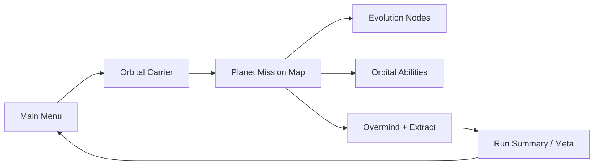

# Empire of Yesterday — Vision Doc

Pitch → implementation phases for the planet reclamation roguelite.

## Core fantasy

You are an **orbital commander** overseeing a lost colony reclamation: drop squads, assign **sectors**, evolve broken builds mid-run, kill the **Overmind**, and extract before cataclysm — **without pausing the battlefield**.

## Run loop

## Phases implemented

| Phase | Feature |
|-------|---------|
| **p1-planet-run** | `PlanetMapData`, `RunState.planet_mode/planet_phase`, `generate_planet()` 18–24 rooms, Overmind, extract window 50–60s, `PlanetMission.tscn` |
| **p1-sector-doctrine** | `SquadsManager` sector doctrines + **SPACE sector overlay** (real-time) |
| **p2-carrier-prep** | `OrbitalCarrier.tscn`, loadout presets, pilot traits, drop sectors, squad stances, run mutators |
| **p3-evolution** | `legacy_biomass` + `yesterdays_echoes`, evolution nodes with **2-choice pick UI**, synergy chains |
| **p4-swarm-queen** | `HivePressure`, 1–2 hives, `SwarmDirector`, `OvermindHive` finale |
| **p5-orbital** | Scan / Strike / Resupply / EMP (real-time) + orbital charge economy |
| **p6-meta-polish** | Imperial Reclamation scoring, biomes, colony tile placeholders, `MAP_ENEMY_CAP` 22 |
| **p7-commander-v2** | Squad roster summary, auto [O] on BEGIN, comms priority filter, objective beats, Hive-Hater vs hives |

## Key autoloads

Order: `RunLog` → `RunState` → `PortraitPool` → `SaveManager` (see `project.godot`).

## Related docs

- [README.md](README.md) — how to play
- [V2_ROADMAP.md](V2_ROADMAP.md) — V2 shipped scope
- [PERFORMANCE.md](PERFORMANCE.md) — runtime tuning (`MAP_ENEMY_CAP`, fog, hives)
- [QA_LIFECYCLE.md](QA_LIFECYCLE.md) — CI smoke tests
- [DOCS_HOUSEKEEPING.md](DOCS_HOUSEKEEPING.md) — archived docs in `docs/archive/`
