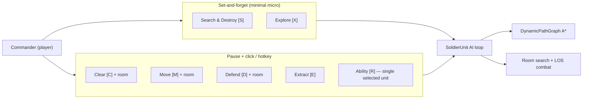
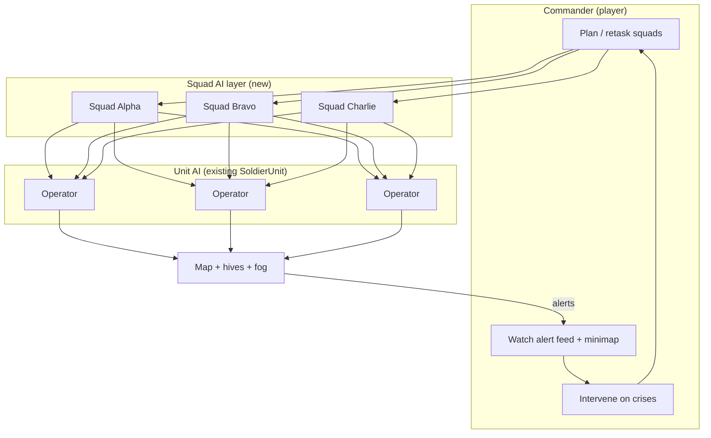
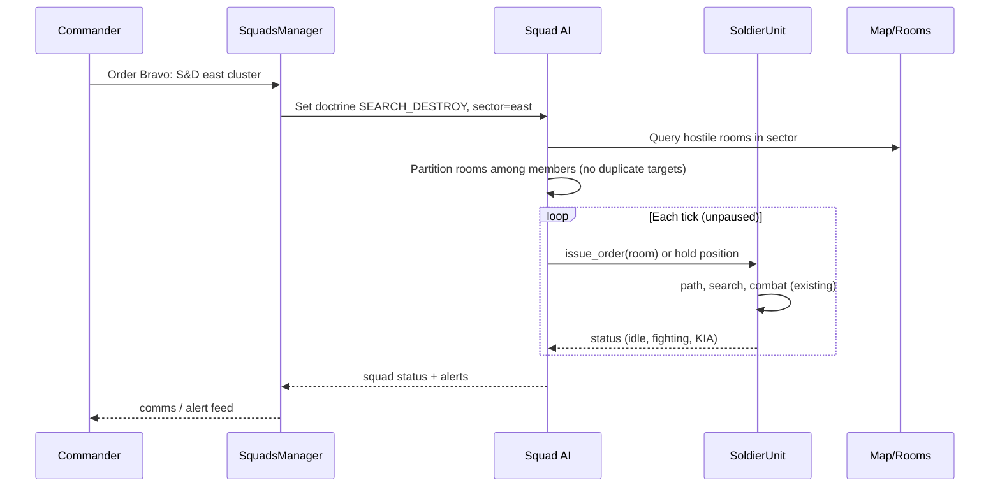
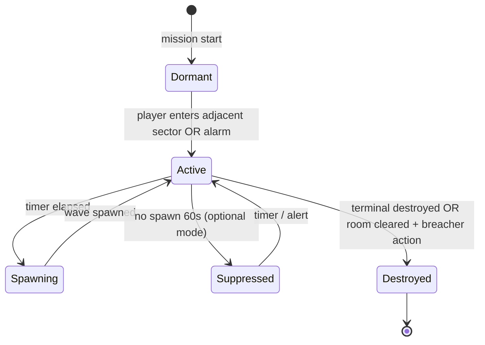
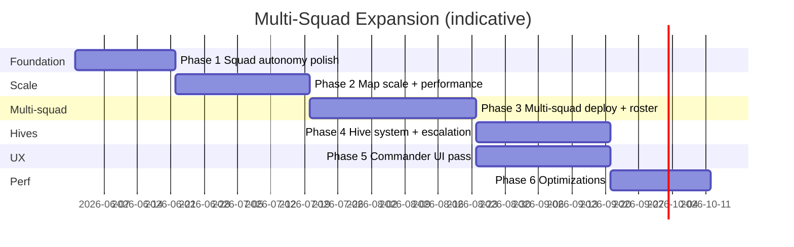

# Multi-Squad Expansion — Design Discussion

*Empires of Yesterday · Godot 4.3+ · May 23, 2026*

This document plans a major expansion: **multiple autonomous squads on larger maps with enemy hives and commander-scale UI**. It is a design discussion only — no gameplay implementation yet.

For current architecture baseline, see also [`PHASE1_DECISIONS.md`](PHASE1_DECISIONS.md).

---

## Locked Decisions

*May 23, 2026 — user confirmed; implementation follows these defaults.*

| Decision | Choice |
|----------|--------|
| **Pause model** | **Global pause (SPACE)** — entire map freezes for planning |
| **Roster** | **3 squads × 4 operators (12 marines)** — Alpha / Bravo / Charlie |
| **Coordination** | **Shared task board** + **unit spacing** (~28px min separation, formation slots in rooms/corridors) |
| **Objective doctrine** | New **[O] Objective** order — auto behavior derived from `objective_template` |
| **Hives** | **C) Both** — ambient hives on large maps (hybrid escalation if ignored) **and** dedicated `hive_purge` objective template |

---

## Current State Summary

Before planning the expansion, here is what the codebase already does.

| System | Current behavior | Multi-squad gap |
|--------|------------------|-----------------|
| **Run loop** | `RunState`: 4 ops/run, flat `squad: Array[SoldierResource]` (max 4), single deploy per mission | No concept of multiple fireteams or split roster |
| **Map** | `ProceduralMapGenerator`: 8–10 rooms, ~1024×640 hull, 2–4 hostile rooms, 1 extract | Too small for parallel fronts; no hive rooms |
| **Deploy** | One secure room chosen at mission start | One spawn point for entire force |
| **Orders** | Per-**operator** via `SoldierUnit.issue_order()` | No squad-level order object |
| **Pause** | Global `TacticalMap.is_paused` freezes all units via `MissionState.is_unit_actions_frozen()` | Commander cannot observe one front while planning another |
| **Autonomy** | S&D and Explore are set-and-forget per unit | Clear/Move/Defend/Extract still need pause + room click |
| **UI** | Left roster (4 cards), right HUD (single unit detail), comms log (80 lines) | Breaks at 2+ squads × 4 operators + hive alerts |
| **Spawning** | Static room enemies at start; `hold_purge` waves every 12s | No persistent hive entity or map-wide escalation |
| **Coordination** | `MissionState.squad_marked_enemy` (one global mark) | No squad-scoped marks, no task assignment dedup |

### What already supports autonomy



**Search & Destroy** (`SoldierUnit._build_search_destroy_queue`, `_advance_search_destroy`): builds a hostile-room queue sorted by distance, paths room-to-room, searches, fights, repeats until `_count_living_enemies() == 0`. Fully autonomous once issued.

**Explore** (`_build_explore_queue`, `_advance_explore`): same pattern for unsearched rooms. Handles combat if hostiles spotted during sweep.

**Defend** is semi-autonomous: once at anchor, unit engages in-room without further input, but placement requires pause + click.

**Clear / Move / Extract** require explicit room targeting while paused (or hotkey then implicit extract room).

### What still requires pause-and-click

1. **Global pause gate** — `MissionState.is_unit_actions_frozen()` returns true when `tactical_map.is_paused`; all movement/combat stops.
2. **Per-operator selection** — keys 1–4, roster cards, map click; no “Squad Alpha” selection.
3. **Order issuance** — `_issue_order_to_selected()` applies pending order to all *selected* operators, not to a squad entity.
4. **Abilities** — `_on_ability_pressed()` fires for `_selected_unit()` only.
5. **Ghost path preview** — only while paused, for selected units.
6. **Deploy** — single `selected_spawn_room`; `_spawn_squad()` places all units in one room.

### Duplicate-work risk (already present, worsens at scale)

Each operator running S&D independently calls `_build_search_destroy_queue()` and `_count_living_enemies()` (full tree scans). On a 1-squad map this is acceptable; with 3 squads × 4 operators all on S&D, the same rooms get queued and pathfind independently with no shared task board.

---

## A. Vision & Player Fantasy

### What “completely autonomous squads” means

**Today:** The player is a **fireteam leader** controlling up to four individual marines in a pause-plan-execute loop. Autonomy exists at the *order* level (S&D, Explore), not the *organization* level.

**Target fantasy:** The player is a **facility commander** overseeing 2–4 squads (8–16 operators) across a large procedural deck. Each squad receives **doctrine-level orders** (“S&D the east wing”, “Hold Reactor”, “Sweep unknown sectors”) and executes without room-by-room babysitting. The commander intervenes for:

- Reassigning squads when hives escalate or casualties mount
- Coordinating extraction windows
- Spending abilities / intel at critical moments
- Responding to alert feed events (hive spawn, squad pinned, VIP/hive objective)

**“Minimal micro” does not mean zero input.** It means:

| Input frequency | Commander action |
|-----------------|------------------|
| Mission start | Assign squad doctrines + deploy zones |
| Every 30–90 s (or on alert) | Adjust one squad’s order or camera focus |
| Crisis | Pause (optional), retask, ability, extract |
| Endgame | Rally squads to extract |

### Commander role at scale



**Recommended default:** Keep **pause-plan-execute** as the core loop but make **squad-level orders the default interaction** (one click assigns 4 operators). Real-time-without-pause can be a later difficulty / “commander mode” option once squad AI is trustworthy.

---

## B. Architecture Changes Needed

### B.1 Data model — multiple squads

Introduce a **`Squad`** resource/node (mission-scoped, not necessarily run-scoped):

```gdscript
# Conceptual — not implemented
class_name Squad
var squad_id: String           # "alpha", "bravo", ...
var callsign: String           # "Alpha-1"
var members: Array[SoldierUnit]
var current_doctrine: OrderType.Type  # squad default
var squad_order: SquadOrder    # new: target room, patrol zone, hive ID, etc.
var deploy_room: Room
var status: SquadStatus        # idle, moving, engaged, pinned, extracting, wiped
```

**RunState changes:**

| Field | Today | Proposed |
|-------|-------|----------|
| `squad` | `Array[SoldierResource]` (4) | `Array[SoldierResource]` (8–16) or `Array[SquadRoster]` |
| Deploy | All in one room | `deploy_assignments: Dictionary` squad_id → room_id |
| Selection | N/A | `active_squad_id` + optional drill-down to operator |

**MissionState changes:**

| Today | Proposed |
|-------|----------|
| Single `squad_marked_enemy` | Per-squad mark dictionary, or marksman marks scoped to squad |
| Global pause | Optional: `planning_squad_id` for “pause only my view” (Phase 5+) |

**TacticalMap changes:**

- `active_units: Array[SoldierUnit]` → grouped by `SquadsManager`
- `_select_unit(index)` → `_select_squad(squad_id)` with optional operator sub-select
- `_issue_order_to_selected()` → `_issue_squad_order(squad, doctrine, target)`

### B.2 Squad-level AI vs unit-level AI

**Principle:** Squad AI assigns **tasks**; unit AI **executes** (existing `SoldierUnit` loop).



**Reuse:** Almost all of `SoldierUnit` order execution (pathfinding, search, combat, extract).

**New logic:**

- Room partition / task board (shared `MissionTaskBoard` autoload or TacticalMap child)
- Squad cohesion (stay within N rooms of leader, regroup on 50% casualties)
- Doctrine presets: `PURGE_SECTOR`, `HOLD_ROOM`, `SCOUT_UNEXPLORED`, `ASSAULT_HIVE`, `RTB_EXTRACT`

**Unit-level AI stays** for intra-room combat, door handling, ability triggers. Squad AI decides *which room* each unit goes to next.

### B.3 Map scaling

**Current** (`ProceduralMapGenerator.gd`):

- `room_count`: 8–10 (+ optional loot branch)
- Hostile rooms: `clampi(op_index + 1, 2, 4)`
- Enemies: 1–2 per hostile room
- `map_size`: derived from hull AABB (~1000–1400 px typical)

**Proposed tiers:**

| Tier | Rooms | Hostile | Hives | Map size (approx) | When |
|------|-------|---------|-------|-------------------|------|
| Current | 8–10 | 2–4 | 0 | 1× | Phase 1 baseline |
| Medium | 14–18 | 5–8 | 1–2 | 1.6× | Phase 2 |
| Large | 22–30 | 8–12 | 2–4 | 2.2× | Phase 3–4 |
| Finale | 5 (handcrafted) | — | 1 boss hive | fixed | existing finale |

**Generator changes:**

- Scale `room_count` from `config.squad_count` and `config.map_tier`
- Add **`hive_room`** role in `_assign_roles()` (spawn-eligible: false, special marker)
- Branch caps / max graph degree to prevent spaghetti
- Sector tags (east/west/north) for squad AI and UI filters

**Camera** (`TacticalMap` already has pan + zoom 0.35–1.6):

- Lower `CAMERA_ZOOM_MIN` to ~0.2 for large maps
- “Jump to squad” hotkeys (F1–F4)
- Optional minimap viewport (Phase 5)

### B.4 Hive entities + spawn waves

**Precursor in codebase:** `hold_purge` already spawns reinforcement waves (`_spawn_hold_wave`, `HOLD_WAVE_INTERVAL := 12.0`). Hives generalize this to persistent map objects.

**Proposed `Hive` node** (room-attached or corridor special):

| Property | Purpose |
|----------|---------|
| `home_room: Room` | Location on map |
| `spawn_interval: float` | Base seconds between waves |
| `spawn_budget: int` | Max concurrent spawned-from-hive enemies |
| `escalation_rate: float` | Interval shrinks over time or on alarm |
| `is_destroyed: bool` | Win/suppress state |
| `archetype_weights` | Rifleman / Heavy / Sniper mix |



**Spawn rules (draft):**

- Initial map enemies remain **static** in hostile rooms (current behavior)
- Hives **add** enemies over time into their room + adjacent corridors
- Spawn cap per hive prevents infinite flood (e.g. 6 living spawned-from-hive)
- Destroyed hive: stop spawns, optional objective credit

**Integration with objectives:**

| Template | Hive role |
|----------|-----------|
| `standard` | 1–2 hives optional; destroy all hives OR clear zones |
| `hold_purge` | Hive feeds hold room; destroying hive slows waves |
| `black_site` | Hives guard terminal sectors |
| `silent_extract` | Hive alarm on destroy compromises silent op |
| `vip_recovery` | Hive near VIP room escalates escort pressure |

### B.5 Pathfinding at scale

**Current:** `DynamicPathGraph` A* on room/door nodes — scales O(nodes) per path request; each unit rebuilds path independently.

**At scale bottlenecks:**

- 16 units + 40 enemies × path rebuilds on door state change
- `_prime_doors_on_route()` scans all doors per rebuild

**Mitigations (Phase 2 / 6):**

1. **Path cache** — key `(from_room_id, to_room_id, door_signature)` → waypoint list
2. **Invalidate on door open** — only paths through that door edge
3. **Squad column movement** — one path per squad, followers use offset slots in same room
4. **Staggered replans** — max N pathfinding requests per frame
5. **Room-level routing for squad AI** — squad planner uses `find_room_route()`; units only pathfind at corridor granularity when entering/leaving rooms

**Reuse:** `DynamicPathGraph`, door blocking, corridor movement in `SoldierUnit` / `EnemyUnit`.

---

## C. Phased Roadmap

Realistic phases with dependencies. Each phase should ship a playable vertical slice before the next.



### Phase 1: Squad-level autonomy polish (single squad, current map)

**Goal:** Prove “minimal micro” on existing 8–10 room maps before adding squads or size.

| Task | Detail |
|------|--------|
| Shared task board | Single squad avoids duplicate S&D room assignment |
| Squad-wide S&D hotkey | One button assigns all alive operators coordinated purge |
| Auto-defend on contact | Optional: operators in Clear auto-hold door when pinned |
| Smarter idle | Operators with no order default to follow squad leader / regroup |
| Comms filtering | Priority lines for contact, casualties, objective |

**Dependencies:** None — extends current `TacticalMap` + `SoldierUnit`.

**Exit criteria:** Player can complete a standard op issuing ≤5 commander actions after deploy (doctrine + extract).

### Phase 2: Map scale-up + performance

**Goal:** 14–18 room maps feel good at 0.25–0.5 zoom; FPS stable.

| Task | Detail |
|------|--------|
| Generator params | `room_count`, hostile count, map tier in `RunState.get_difficulty_config()` |
| Fog LOD | Reduce LOS checks for distant unrevealed rooms |
| Path cache | Shared cache on `DynamicPathGraph` |
| Camera | Jump-to-objective, wider zoom range |

**Dependencies:** Phase 1 task board helps perf (fewer redundant paths).

**Exit criteria:** 18-room map, 1 squad, 60 FPS on target hardware; mission time 8–15 min.

### Phase 3: Multi-squad deploy + squad roster UI

**Goal:** 2 squads × 4 operators, separate deploy rooms, squad selection.

| Task | Detail |
|------|--------|
| `Squad` + `SquadsManager` | Group units, squad orders |
| Multi deploy UI | Assign Alpha → room A, Bravo → room B at mission start |
| RunState roster | 8 operators across 2 squads (class limits per squad TBD) |
| Squad roster panel | Collapsible squad cards; click squad vs operator |
| Squad hotkeys | F1/F2 squad select; orders apply to whole squad |

**Dependencies:** Phase 2 map size (squads need spatial separation).

**Exit criteria:** 2 squads purge opposite wings without constant pause; win standard objective.

### Phase 4: Hive system + escalation

**Goal:** Persistent pressure; destroy-or-suppress decision matters.

| Task | Detail |
|------|--------|
| `Hive` entity + scene | Room marker, spawn timer, wave logic |
| Generator placement | 1–2 hives on medium/large maps |
| Hive objectives | New template `hive_purge` or extend `standard` |
| Alarm interaction | Hive activation + rifleman alarm stacking |
| Hold purge merge | Hold room fed by hive vs timer waves |

**Dependencies:** Phase 3 (multiple squads to handle multi-front escalation).

**Exit criteria:** Player destroys 2 hives + extracts; escalation feels threatening not unfair.

### Phase 5: UI/UX pass — commander view

**Goal:** Information at a glance for 2–4 squads on large maps.

| Task | Detail |
|------|--------|
| Minimap | Rooms, fog, squad icons, hive pings |
| Alert feed | Structured events vs flat comms log |
| Squad tabs / cards | Status: doctrine, HP aggregate, current sector |
| Threat map | Last-known hostile contacts by room |
| Condensed comms | Filter: All / Alerts / Combat / Objectives |

**Dependencies:** Phase 3 (multi-squad); can parallel Phase 4.

**Exit criteria:** Player identifies squad in trouble within 3 s without hunting the map.

### Phase 6: Cross-board optimizations

**Goal:** Headroom for 30 rooms, 16 units, 30+ enemies, 4 hives.

| Task | Detail |
|------|--------|
| Entity pooling | `SoldierUnit`, `EnemyUnit`, `CombatFx`, comms lines |
| Update throttling | Enemy AI every 2–3 frames at distance; full rate when visible |
| LOS batching | Spatial hash by room; only check cross-room LOS at doors |
| `_process` budget | Profile-driven caps on pathfinding / fog per frame |
| SubViewport LOD | Lower update rate for off-screen world (optional) |

**Dependencies:** Phases 2–4 content to stress-test.

**Exit criteria:** Large map scenario holds 60 FPS (or documented min spec).

---

## D. UI/UX Specifics

### What breaks at multi-squad scale

| UI element | Current limit | Failure mode |
|------------|---------------|--------------|
| **Left roster** (`SquadRosterPanel`) | 4 `OperatorRosterCard` | 8–16 cards overflow scroll; no squad grouping |
| **Right HUD** (`UnitPanel`) | Single operator detail | Wrong mental model when commanding squads |
| **Comms log** (`MAX_COMMS_LINES := 80`) | Flat chronological | Combat spam drowns hive/squad alerts |
| **Order panel** | Per selected operator(s) | Issuing same order 4× per squad × N squads |
| **Selection** | Keys 1–4 | No squad-level select; multi-select across squads confusing |
| **Map** | Full tactical view | Operators visually overlap; hard to see squad identity |
| **Objectives banner** | Single primary string | No hive count, no per-squad extract status |
| **Ghost preview** | Selected units only | Cluttered with 8+ path lines |

### Proposed solutions

#### Squad cards (left panel redesign)

```
┌─ ALPHA (4/4) ────────────────┐
│ [■■■■] HP 78%  │ S&D East   │
│ ▸ Rook  Assault  Engaging    │
│ ▸ Holt  Support  Moving      │
│   ... collapsed by default   │
└──────────────────────────────┘
┌─ BRAVO (3/4) ─── ⚠ PINNED ──┐
│ ...
```

- **Squad header** = select target for orders; click header to expand operators
- **Aggregate HP bar** + doctrine label + status badge (Moving / Engaged / Pinned / Extracting)
- Color-coded squad tint on map (`GameTheme` extension)

#### Threat map / intel layer

- Toggle overlay: rooms with `last_hostile_contact` (already on `Room`) + hive icons
- “Unknown + audio contact” from `_maybe_audio_threat_ping` aggregated per sector
- Dim cleared sectors

#### Hive markers

- Distinct icon on unrevealed adjacent sectors: “bio signature” ping when scout enters range
- Revealed: pulsing spawn timer arc (optional), destroy objective checkbox on objective banner

#### Condensed comms

| Channel | Examples |
|---------|----------|
| **Alerts** | Squad pinned, hive spawn, KIA, alarm |
| **Combat** | Individual hit lines (collapse by default) |
| **Objectives** | Room secured, terminal destroyed, evac unlocked |
| **Squad** | Doctrine changes, regroup |

Implementation: tag lines in `log_message()` with category; filter UI before join.

#### Minimap (Phase 5)

- Render room graph simplified; fog as dark overlay
- Squad centroid dots; hive skull icons; extract green
- Click minimap → camera pan

#### Commander HUD (replace single-unit panel when squad selected)

When squad selected, right panel shows:

- Squad callsign + doctrine dropdown (S&D / Hold / Explore / Extract)
- “Assign sector” (click map) or “Assault hive” (click hive)
- Ability row: one **squad ability** or per-class quick slots (design TBD)

---

## E. Hive Design

### Spawn rules (detailed)

| Parameter | Suggested default | Notes |
|-----------|-------------------|-------|
| `base_interval` | 18–25 s | Slower than hold waves early |
| `min_interval` | 8 s | Escalation floor |
| `wave_size` | 1 + floor(op_index / 2) | Scales with run |
| `spawn_cap` | 4–6 per hive | Living spawned enemies |
| `activation_range` | Adjacent room revealed OR direct contact | Stealth ops can defer activation |
| `spawn_location` | Hive room center + corridor adjacency | Uses existing `register_enemy` |

**Archetype mix:** Early waves rifleman; op 3+ adds heavy; sniper if hive in choke room.

### Destroy-to-win vs suppress

| Mode | Player action | Hive behavior | Best for |
|------|---------------|---------------|----------|
| **Destroy** | Clear hive room + interact (breach terminal) OR deal X damage to hive node | Permanent off | Standard purge, black site |
| **Suppress** | Hold adjacent room 45 s without spawn | Paused 90 s, then reactivates | Silent extract, resource-limited squads |
| **Contain** | Defend corridor; never destroy | Spawn rate reduced 50% | VIP escort — trade time for safety |

**Recommendation:** Default **destroy-to-win** for clarity; suppress as op modifier or silent-extract constraint.

### Interaction with objective templates

| Template | Hive objective |
|----------|----------------|
| `standard` | Optional secondary: “Destroy N hives” OR hives buff cleared zones’ remaining enemies |
| `hold_purge` | Hive reinforces hold room until destroyed |
| `black_site` | One hive per terminal cluster |
| `silent_extract` | Destroying hive triggers alarm (like rifleman) |
| `vip_recovery` | Escort path avoids hive sectors unless player chooses shortcut |
| **New: `hive_purge`** | Primary: destroy all hives; secondary: extract |

### Hive ↔ existing wave code

Reuse from `TacticalMap._spawn_hold_wave()`:

- Enemy instantiation pipeline (`Enemy.create_archetype`, `room.register_enemy`)
- `active_enemies` tracking, `_on_enemy_died`
- Alarm hook (`_on_enemy_alarm_triggered`)

Extract into `SpawnDirector` or `Hive.gd` to avoid duplicating spawn logic.

---

## F. Optimization Targets

### What to measure

| Metric | Tool | Target (medium map) |
|--------|------|---------------------|
| Frame time (ms) | Godot profiler | ≤16.6 ms avg |
| `_process` time — TacticalMap | Profiler | ≤2 ms |
| `_process` + `_physics_process` — all units | Profiler | ≤6 ms |
| `_update_fog_of_war` | Custom timer | ≤3 ms |
| Pathfind calls / frame | Counter | ≤4 |
| Active enemies + soldiers | Scene stats | 16 + 35 max |
| Draw calls | Renderer | Monitor on growth |

### Likely bottlenecks (ordered)

1. **Fog / LOS loop** (`TacticalMap._update_fog_of_war`): O(soldiers × rooms) reveal + O(enemies × soldiers) LOS. **Worst case at scale.**

2. **Per-unit tree scans**: `_count_living_enemies()`, `_build_search_destroy_queue()`, enemy `_find_nearest_soldier()` all iterate groups.

3. **Pathfinding**: `_rebuild_corridor_path()` on every unit when doors toggle.

4. **Comms / UI refresh**: `_refresh_roster()` + `_update_hud()` every frame while active.

5. **Combat FX**: Unpooled spawn nodes.

### Mitigation priority

| Priority | Fix | Phase |
|----------|-----|-------|
| P0 | Room-indexed entity lists (soldiers/enemies per room) | 2 |
| P0 | Fog: only update revealed + frontier rooms | 2 |
| P1 | Shared mission task board (reduce redundant AI) | 1 |
| P1 | Path cache on DynamicPathGraph | 2 |
| P2 | Pool EnemyUnit / FX | 6 |
| P2 | Throttle distant enemy AI | 6 |
| P3 | Batch HUD refresh (10 Hz) | 5 |

---

## G. Open Questions for User

These decisions block detailed spec work. **Top 3** for immediate discussion called out at end.

### Q1 — Pause model at scale (CRITICAL)

**Options:**

- **A) Keep global pause** (SPACE pauses entire map) — simple, matches current UX
- **B) Squad-scoped planning** — pause planning for one squad while others execute (complex)
- **C) Real-time only** — orders issued on live map with slow-mo optional

**Recommendation:** **A** for Phases 1–4; experiment with **C** in Phase 5 “commander difficulty.”

### Q2 — Squad count and roster size (CRITICAL)

**Options:**

- 2 squads × 4 (8 operators) — conservative, fits roguelite heal economy
- 3 squads × 3 (9 operators) — asymmetric
- 4 squads × 4 (16 operators) — maximum chaos

**Recommendation:** Start **2×4**; scale to **3×4** after Phase 5 UI proven.

### Q3 — Hive win condition (CRITICAL)

**Options:**

- Destroy all hives to unlock extract (hard gate)
- Hives optional bonus; primary objective remains clear zones
- Hybrid: hives accelerate enemy respawn until destroyed (soft gate)

**Recommendation:** **Hybrid** — hives don’t block extract but make late mission harder if ignored.

### Q4 — Run loop integration

Should multi-squad expand the **run roster** (hire 8 marines at hub) or **split one 4-marine roster into 2 squads of 2** for early experiments?

### Q5 — Coordination vs independence

When two squads S&D the same sector, should squad AI **merge** (one task board) or **race** (first come, first served)?

**Recommendation:** Shared task board — fits “commander” not “competitive AI.”

---

## Reuse vs Rewrite

### Reuse (extend, don’t replace)

| Component | Reuse strategy |
|-----------|----------------|
| `SoldierUnit.gd` | Keep unit execution; add optional `assigned_squad_id`, follow-leader |
| `EnemyUnit.gd` | Keep; hive spawns use same setup |
| `DynamicPathGraph.gd` | Add cache layer; room routes for squad AI |
| `ProceduralMapGenerator.gd` | Parameterize counts; add hive role |
| `Room.gd` | Add sector tag, hive attachment, squad presence summary |
| `OrderType.gd` | Add squad doctrines or parallel `SquadOrderType` |
| `RunState.gd` | Extend roster + deploy metadata |
| `SquadRosterPanel` / `OperatorRosterCard` | Evolve to nested squad UI |
| `hold_purge` waves | Extract to `Hive` / `SpawnDirector` |
| `LineOfSight.gd` | Keep; optimize caller (room index) |
| Objective templates | Extend with hive fields on `MissionMapData` |
| Pause / comms / camera | Incremental upgrades |

### Rewrite or new modules

| Component | Why |
|-----------|-----|
| **`SquadsManager`** | New orchestration layer |
| **`MissionTaskBoard`** | Shared room assignment state |
| **`Hive.gd`** | New entity type |
| **`SpawnDirector`** | Unify static spawn, hold waves, hive waves |
| **Selection model in `TacticalMap`** | Squad-first selection is a different UX model |
| **Comms categorization** | Structured feed vs flat `RichTextLabel` append |

### Do not rewrite

- Core pause gate pattern (`MissionState.is_unit_actions_frozen`) — works; extend don’t remove
- Corridor + door movement model — solid for scale with caching
- Roguelite debrief / hub loop — orthogonal to multi-squad

---

## Appendix: Current Code Anchors

For implementers reviewing this doc against the repo:

| Concern | File | Key symbols |
|---------|------|-------------|
| Pause gate | `MissionState.gd` | `is_unit_actions_frozen()` |
| Unit autonomy | `SoldierUnit.gd` | `issue_order`, `_advance_search_destroy`, `_advance_explore` |
| Commander UI | `TacticalMap.gd` | `_issue_order_to_selected`, `_update_hud`, `log_message` |
| Map size | `ProceduralMapGenerator.gd` | `room_count` 8–10, `_assign_roles` |
| Spawning | `TacticalMap.gd` | `_spawn_enemies`, `_spawn_hold_wave` |
| Roster | `SquadRosterPanel.gd`, `OperatorRosterCard.gd` | per-operator cards |
| Run loop | `RunState.gd` | `squad`, `ops_per_run`, `get_difficulty_config()` |
| Deploy | `TacticalMap.gd` | `_begin_spawn_selection`, `_spawn_squad` |
| Fog / LOS | `TacticalMap.gd`, `LineOfSight.gd` | `_update_fog_of_war` |

---

*Document for design discussion — implementation tracking should live in issue/PR milestones per phase.*
